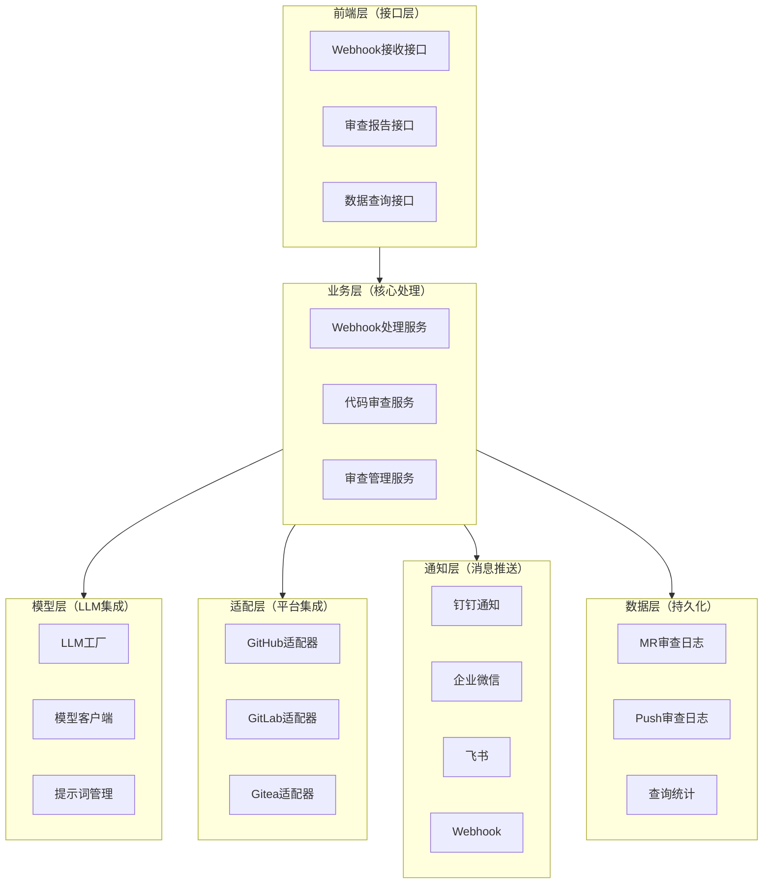
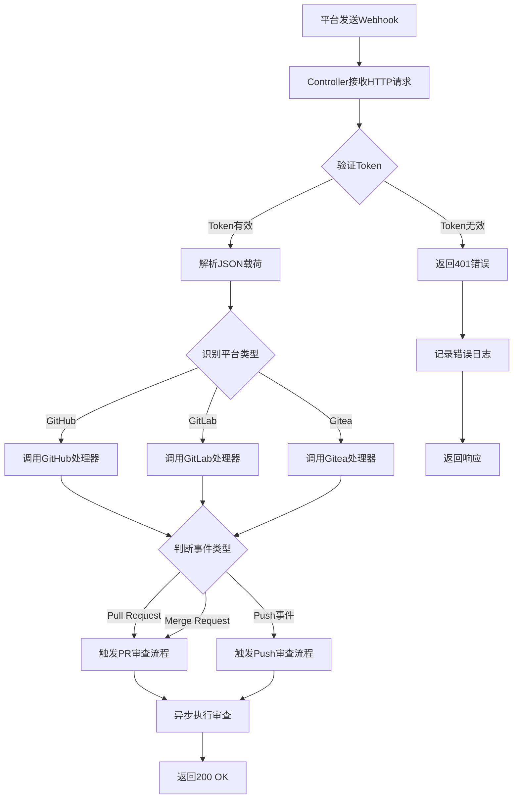
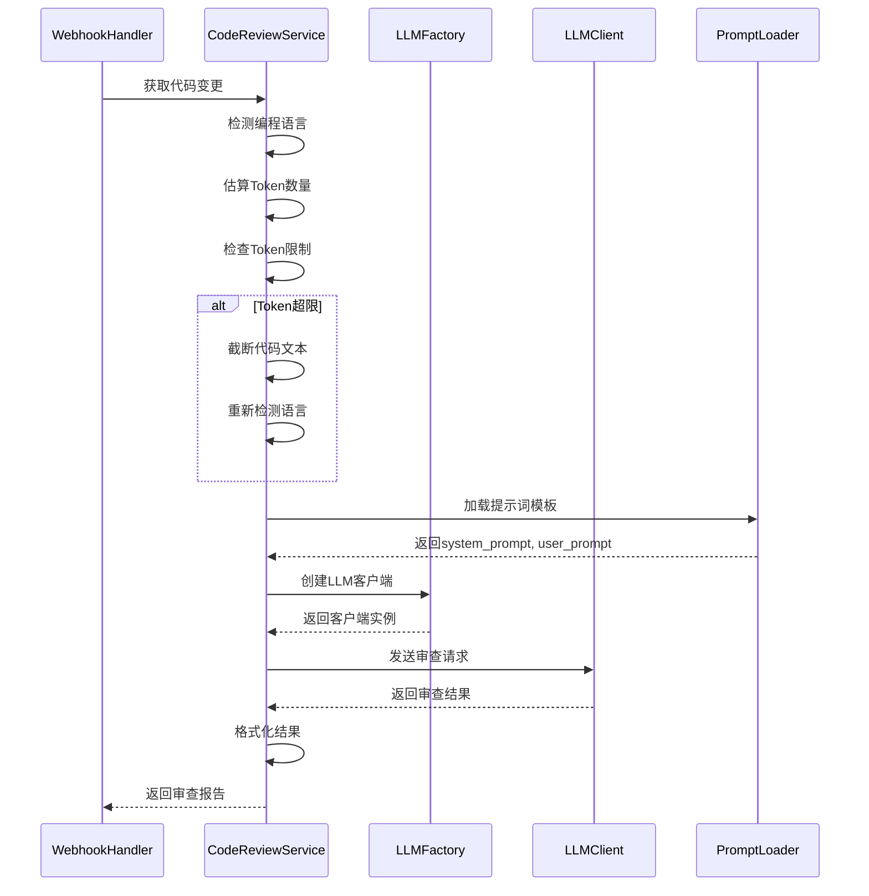
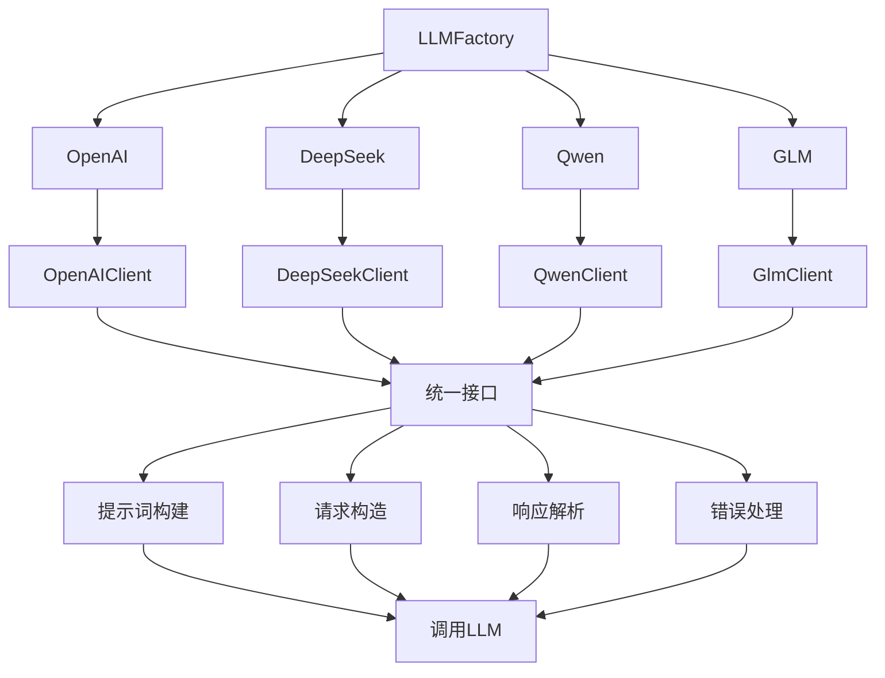
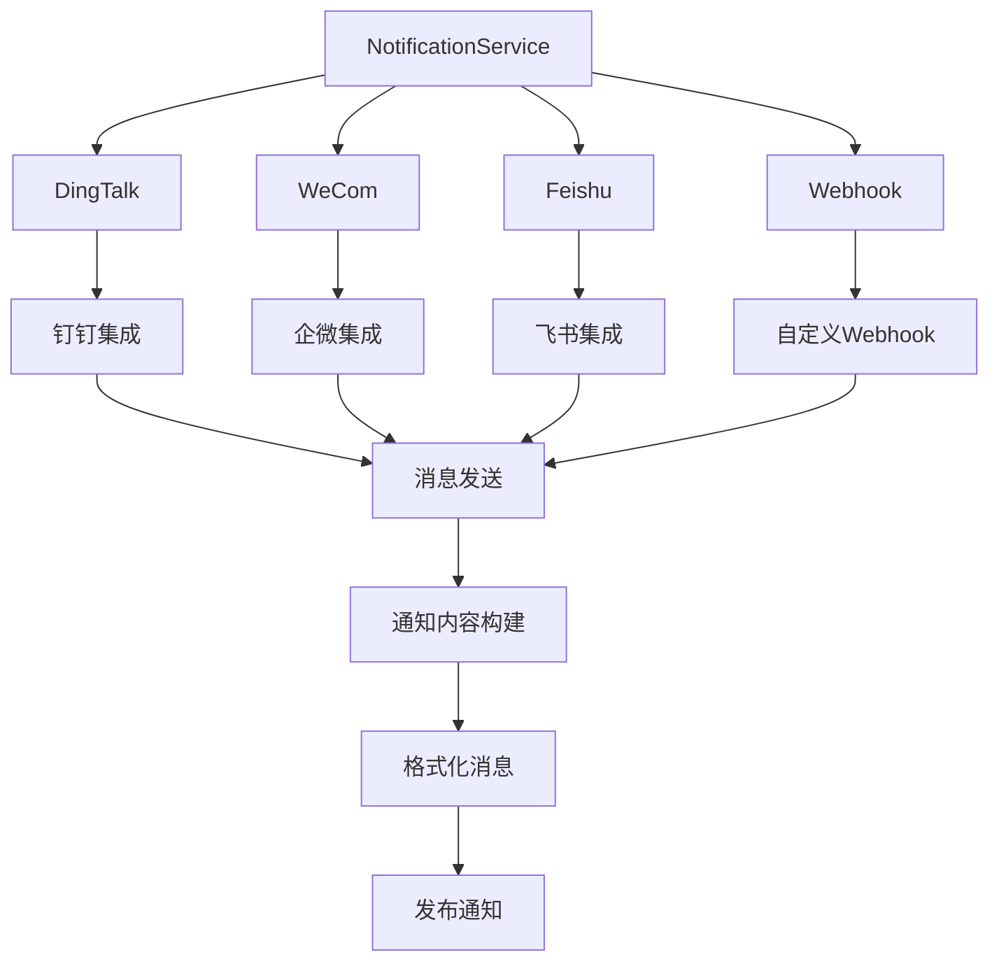
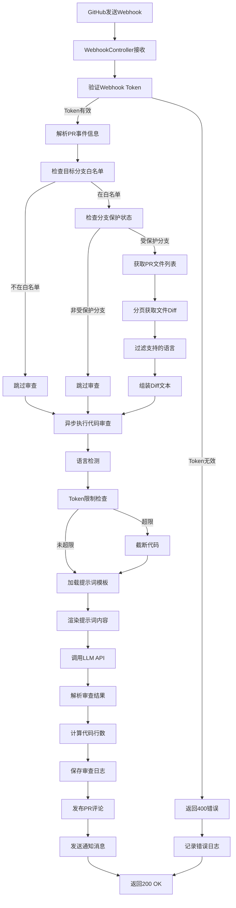
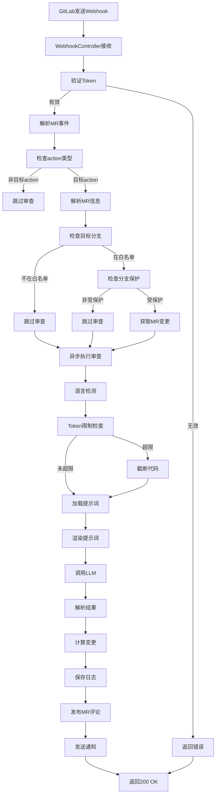
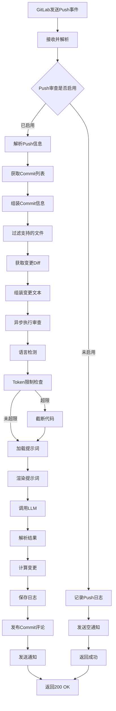

# 《智能代码审查系统》架构设计-第01节：总体架构设计与流程梳理

作者：冰河
<br/>星球：[http://m6z.cn/6aeFbs](http://m6z.cn/6aeFbs)
<br/>博客：[https://binghe.site](https://binghe.site)
<br/>文章汇总：[https://binghe.site/md/all/all.html](https://binghe.site/md/all/all.html)
<br/>源码获取地址：[https://t.zsxq.com/UIr1U](https://t.zsxq.com/UIr1U)

> 沉淀，成长，突破，帮助他人，成就自我。

**大家好，我是冰河~~**

> 花了一周搭起来的 AI 代码审查机器人，把 GitLab 上的 MR 自动扫一遍，得分、评论、钉钉通知一条龙。嘎嘎强！

## 一、再说说为什么要自己手撸

先说背景。我们团队日常用 GitLab，代码审查基本靠人肉。一个 MR 从提交到合并，平均要等半天，因为能看懂复杂代码的就那么两三个人。而且每个人标准不一样，有人死磕命名，有人只看逻辑，新同学经常不知道听谁的。

后来试过一些现成的 AI 代码审查工具，要么只支持 GitHub，要么太贵，要么审查结果像“机翻”——说了一堆正确的废话，但就是没点到要害。干脆自己动手。

定了个小目标：**代码提交后 10 秒内给出反馈，覆盖所有变更，统一评分标准，顺便把审查结果推送到钉钉群**。

实际跑起来之后，效果比预想的好。一个 MR 的审查时间从平均 45 分钟压缩到 5 分钟（主要花在看 AI 结果上），人力投入少了 80% 以上。下面这张表是我们内部统计的对比：

| 审查环节 | 人工方式       | AI 辅助       | 提升     |
| -------- | -------------- | ------------- | -------- |
| 获取变更 | 5-10 分钟      | 1-2 分钟      | 70%      |
| 阅读代码 | 10-20 分钟     | 2-3 分钟      | 80%      |
| 评估质量 | 5-10 分钟      | 1-2 分钟      | 75%      |
| 撰写反馈 | 10-20 分钟     | 2-5 分钟      | 75%      |
| **合计** | **30-60 分钟** | **5-10 分钟** | **80%+** |

API 调用成本呢？平均一次 MR 几分钱，跟人力成本比可以忽略不计。

## 二、整体架构

系统的分层结构比较清晰，从下往上：



选型上偏务实：Spring Boot 3.2.5 + Java 17，数据层用 Spring Data JPA，简单场景，个人使用的话，数据库可以选 SQLite，公司级别使用可以选择MySQL或者TiDB。HTTP 客户端选了 OkHttp，连接池、超时控制都现成。

## 三、核心模块详解

### 3.1 Webhook 接收模块：系统的耳朵

Git 平台通过 Webhook 把代码变更事件推过来，我们要做三件事：**验身份、判类型、丢异步**。

流程图长这样：



**关键细节**：

- Token 验证不能省，否则任何人都可以伪造请求来消耗你的 API 额度。
- 不同平台的事件体差异很大，我们写了三个独立的 Handler，但接口统一。新增平台只需实现一个类。
- 处理过程必须异步，否则 Webhook 会超时重试。用 `@Async` 丢到线程池里跑，主线程立即返回 200。

### 3.2 代码审查模块：真正的“大脑”

这是最核心的部分。流程如下：



**几个容易翻车的地方**：

**（1）语言检测**  

不能只看文件后缀。比如 Vue 文件，里面可能是 JavaScript 也可能是 TypeScript。我们的做法：后缀 + 内容特征双重判断。后缀给个基础分，再扫描代码中的关键字（`def`、`function`、`interface` 等），最后取分高的。

**（2）Token 限制**  

GPT-3.5 上下文 16K，但实际 diff 太大时要么截断要么报错。我们做了智能截断：优先保留文件头、函数签名、新增/修改的行，注释和空行能省就省。实测 10K token 以内的 diff 覆盖了 90% 的 MR。

**（3）提示词模板**  

不同语言需要不同的关注点。我们搞了分层模板：  

- 基础模板：通用规则（空指针、资源泄漏、异常处理等）  
- 语言扩展：Python 要检查 PEP8 和类型提示，Go 要检查 error 处理，JS/TS 要检查 async/await 使用  
用 Jinja2 语法渲染，支持条件判断。这样加一门新语言时，只需要写几十行扩展规则。

### 3.3 LLM 集成模块：多模型适配

我们不想绑定某一家模型，所以做了工厂模式：



每个客户端实现同一个接口：`completions(messages)`。内部处理 API Key、超时、重试、错误码转换。切换模型只需要改配置文件的 `llm.provider`。

实际使用中，日常 MR 用 DeepSeek（便宜，速度还行），核心模块或者可疑的复杂变更切到 GLM-4 或 GPT-4。成本比全用 GPT-4 降了 60%。

### 3.4 通知模块：把结果推出去

审查结果除了发到 MR 评论区，还要推送到钉钉群，让相关人及时看到。



每个渠道一个实现，消息模板支持变量替换。钉钉和企微的 Markdown 格式略有差异，我们单独处理了。另外消息长度有限制，超长时自动截断并加“...”和链接。

### 3.5 数据持久化

虽然 AI 审查结果不重要到要永久保存，但为了后续统计和复盘，还是存了。

两张核心表：`mr_review_log` 和 `push_review_log`。字段包括：项目名、提交者、分支、变更行数、评分、审查结果摘要、URL、创建时间等。

用 JPA 自动建表，SQLite 文件数据库，部署简单。统计功能后面可以按人、按项目、按时间段查询平均分和问题趋势。

## 四、关键流程图文拆解

### 4.1 GitHub Pull Request 审查完整流程



几个细节：

- **分支过滤**：只审查 `main`、`develop` 和受保护分支，个人分支跳过快审。
- **分页获取**：GitHub API 一次最多返回 100 个文件，需要循环拉取直到取完。
- **异步执行**：主线程返回 200 后，后台线程慢慢跑审查，跑完再通过 API 发评论。

### 4.2 GitLab Merge Request 审查流程

GitLab 和 GitHub 的 API 略有不同，但流程大同小异。



GitLab 的 MR 事件有一个 `action` 字段，我们只处理 `open`、`reopen`、`update`，避免合并时重复审查。

### 4.3 Push 事件审查流程

Push 审查是可选的，因为频繁 push 会触发大量审查，容易把 API 额度刷爆。默认关闭，需要手动开启。



Push 审查的评论只会发到第一个 commit 上，避免一个分支多个 commit 刷屏。

## 五、配置与运维

### 5.1 配置文件结构

我们用 YAML 做配置，支持环境变量覆盖。关键配置项：

```yaml
llm:
  provider: deepseek        # openai, deepseek, qwen, glm
  api-key: ${LLM_API_KEY}
  model: deepseek-chat
  max-tokens: 10000

gitlab:
  url: https://gitlab.example.com
  token: ${GITLAB_TOKEN}
  branches: main,develop,release/*

review:
  file-extensions: .java,.py,.js,.ts,.vue,.go
  style: professional      # professional, gentle, humorous
  enable-push-review: false

notification:
  dingtalk:
    webhook: ${DINGTALK_WEBHOOK}
    enabled: true
```

敏感信息（Token、API Key）通过环境变量注入，不进 Git。

### 5.2 错误处理与容错

系统里到处是远程调用，必须考虑失败场景。

- **Webhook 接收层**：Token 无效直接 401，JSON 解析失败返回 400，并记录详细日志。
- **代码获取层**：API 调用失败重试 3 次，还失败就跳过本次审查并发送告警。
- **LLM 调用层**：超时或限流时，等待后重试；如果模型挂了，自动降级到备用模型（需要提前配置）。
- **通知层**：发消息失败只记日志，不影响主流程。

异步任务之间是隔离的，一个 MR 审查挂了不会影响其他 MR。

### 5.3 监控与日志

日志分了三个级别：

- INFO：谁在什么时候触发了审查，用了什么模型，耗时多少。
- WARN：Token 截断、语言检测失败但可继续。
- ERROR：API 调用失败、数据库写入失败等需要人工介入的。

另外暴露了一个健康检查接口 `/actuator/health`，返回 200 表示服务正常，K8s 探针用。

## 六、性能优化与扩展性

### 6.1 异步处理

所有审查任务都用 `@Async` 放到独立线程池。Webhook 响应时间从几秒降到 100ms 以内，GitLab/GitHub 不再超时重试。

线程池配置：

```
corePoolSize = 5
maxPoolSize = 20
queueCapacity = 100
```

### 6.2 HTTP 连接池

OkHttp 连接池复用，避免每次调用都三次握手。配置：

```java
connectionPool = new ConnectionPool(20, 5, TimeUnit.MINUTES);
```

### 6.3 分页与缓存

- **分页**：获取文件列表时，按页拉取，合并后再处理，避免一次加载几 MB 的 diff。
- **缓存**：提示词模板在启动时加载到内存，不用每次读文件。审查结果不做全局缓存（因为代码变更几乎不会重复），但可以针对同一个 MR 的多次 push 做内存去重（简单判断 diff 是否一样）。

### 6.4 扩展性

系统设计时预留了几个扩展点：

## 查看完整文章

加入[冰河技术](https://public.zsxq.com/groups/48848484411888.html)知识星球，解锁完整技术文章、小册、视频与完整代码

## 写在最后

在冰河技术知识星球， **《AI智能代码审查平台》、《AI全链路短剧生成平台》** 已完结，同时，**《企业级微服务开放平台》** 项目热更中，还有其他二十几个项目，像实战Claude Code、AI知识库系统、智流助手平台、智能成语挑战赛项目、多轮AI智能对话系统、一站式AI智能平台、AI智能客服系统、AI智能问答系统、实战AI大模型、手写高性能敏组件、手写线程池、手写高性能SQL引擎、手写高性能Polaris网关、手写高性能熔断组件、手写通用指标上报组件、手写高性能数据库路由组件、手写分布式IM即时通讯系统、手写Seckill分布式秒杀系统、手写高性能RPC、实战高并发设计模式、简易商城系统等等。

这些项目的需求、方案、架构、落地等均来自互联网真实业务场景，让你真正学到互联网大厂的业务与技术落地方案，并将其有效转化为自己的知识储备。

**值得一提的是：冰河自研的Polaris高性能网关比某些开源网关项目性能更高，目前正在热更AI一体化项目，也正在实现MCP，全程带你分析原理和手撸代码。**

你还在等啥？不少小伙伴经过星球硬核技术和项目的历练，早已成功跳槽加薪，实现薪资翻倍，而你，还在原地踏步，抱怨大环境不好。抛弃焦虑和抱怨，我们一起塌下心来沉淀硬核技术和项目，让自己的薪资更上一层楼。

🚀PS：**目前已开通最大优惠：长按或扫码加入星球立减30，注意：随着项目和专栏的更新，星球也即将涨价！！**

<div align="center">
    
    <div style="font-size: 18px;"></div>
    <br/>
</div>

目前，领券加入星球就可以跟冰河一起学习《实战Claude Code》、《多轮AI智能对话系统》、《一站式AI智能平台》、《AI智能客服系统》、《AI智能问答系统》、《实战AI大模型》、《手写高性能Redis组件》、《手写高性能脱敏组件》、《手写线程池》、《手写高性能SQL引擎》、《手写高性能Polaris网关》、《手写高性能RPC项目》、《分布式Seckill秒杀系统》、《分布式IM即时通讯系统》《手写高性能通用熔断组件项目》、《手写高性能通用监控指标上报组件》、《手写高性能数据库路由组件》、《手写简易商城脚手架项目》、《Spring6核心技术与源码解析》和《实战高并发设计模式》，从零开始介绍原理、设计架构、手撸代码。

**花很少的钱就能学这么多硬核技术、中间件项目和大厂秒杀系统、分布式IM即时通讯系统，AI大模型项目，比其他培训机构不知便宜多少倍，硬核多少倍，如果是我，我会买他个十年！**

加入要趁早，后续还会随着项目和加入的人数涨价，而且只会涨，不会降，先加入的小伙伴就是赚到。

另外，还有一个限时福利，邀请一个小伙伴加入，冰河就会给一笔 **分享有奖** ，有些小伙伴都邀请了50+人，早就回本了！

## 其他方式加入星球

- **链接** ：打开链接 http://m6z.cn/6aeFbs 加入星球。
- **回复** ：在公众号 **冰河技术** 回复 **星球** 领取优惠券加入星球。

**特别提醒：** 苹果用户进圈或续费，请加微信 **hacker_binghe** 扫二维码，或者去公众号 **冰河技术** 回复 **星球** 扫二维码加入星球。

**好了，今天就到这儿吧，我是冰河，我们下期见~~**