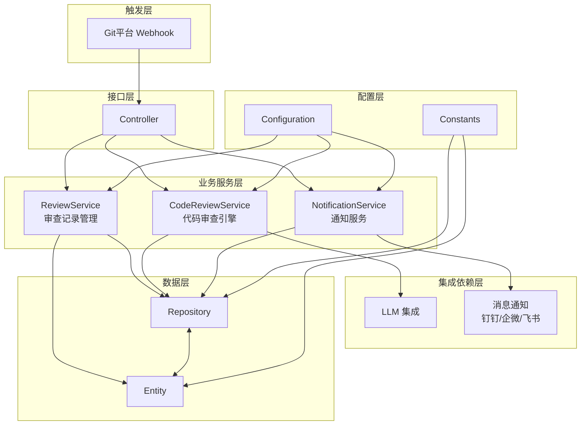
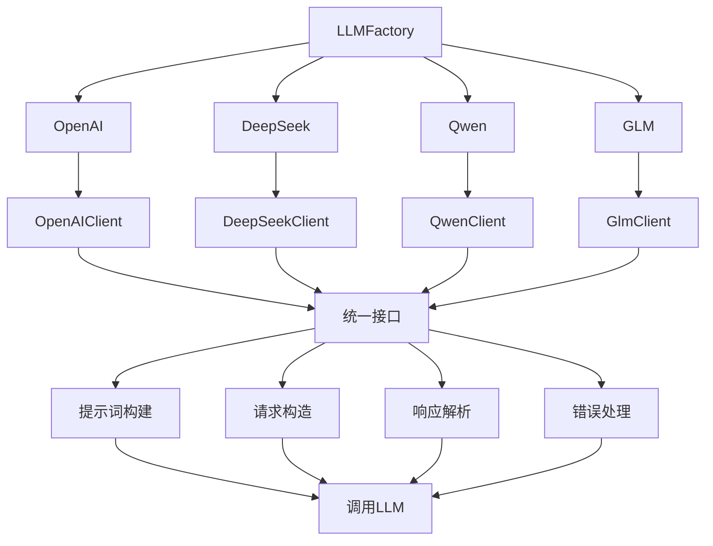
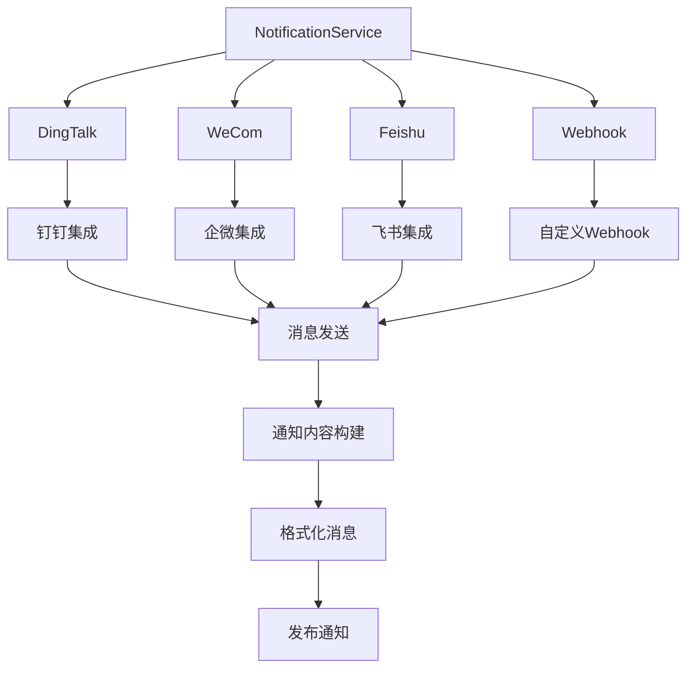
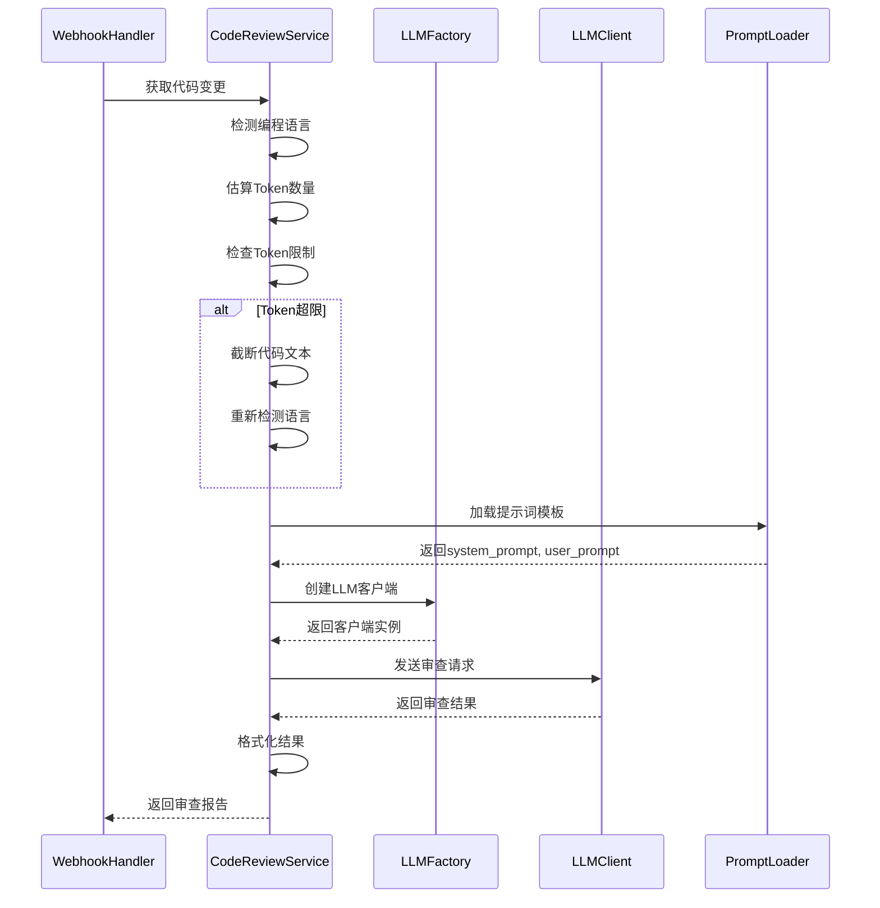

# 《智能代码审查系统》架构设计-第02节：项目总体结构与模块流程梳理

作者：冰河
<br/>星球：[http://m6z.cn/6aeFbs](http://m6z.cn/6aeFbs)
<br/>博客：[https://binghe.site](https://binghe.site)
<br/>文章汇总：[https://binghe.site/md/all/all.html](https://binghe.site/md/all/all.html)
<br/>源码获取地址：[https://t.zsxq.com/UIr1U](https://t.zsxq.com/UIr1U)

> 沉淀，成长，突破，帮助他人，成就自我。

**大家好，我是冰河~~**

> 花了不少时间整理这套代码结构，从目录到包、从配置到扩展点，都捋了一遍。

## 一、背景

先说清楚：这是一个基于 Spring Boot 的代码审查机器人，接上 GitLab/GitHub 的 Webhook，拿到 diff 后丢给大模型（OpenAI、DeepSeek、通义千问、智谱 GLM 都支持）分析，最后把结果评论到 MR 上，顺便推送到钉钉/企微/飞书。

技术栈不复杂，就是常见的 Spring Boot 3 + Java 17 + Maven + JPA + SQLite/MySQL，外加 OkHttp 做 HTTP 调用。

项目结构参考了 Easy-AI-CodeReview 的思路，但我们在多平台、多模型、多通知渠道上做了更多扩展。

## 二、整体目录长什么样

```
ai-review/
├── src/
│   ├── main/
│   │   ├── java/io/binghe/ai/review/
│   │   │   ├── AiReviewApplication.java          # 启动类
│   │   │   ├── config/                           # 各种配置
│   │   │   ├── constants/                        # 常量，避免魔法值
│   │   │   ├── controller/                       # REST 接口
│   │   │   ├── entity/                           # 数据库实体
│   │   │   ├── llm/                              # 大模型客户端们
│   │   │   ├── messaging/                        # 钉钉企微飞书通知
│   │   │   ├── repository/                       # JPA 数据访问
│   │   │   ├── service/                          # 核心业务逻辑
│   │   │   └── webhook/                          # Git 平台适配器
│   │   └── resources/
│   │       ├── application.yml                   # 主配置
│   │       ├── prompt_templates.yml              # 提示词模板库
│   │       └── static/                            # 前端页面（简单）
│   └── test/                                      # 测试代码
├── data/                                          # 运行时数据
│   ├── data.db                                    # SQLite 数据库
│   └── settings.json
├── pom.xml
└── .env.example
```

## 三、包结构与职责（附架构图）

先看一张总图，后面拆开说。



### 3.1 config 包 – 配置管理

就两个类：
- `AsyncConfig`：配置线程池，异步任务全靠它。
- `WebConfig`：CORS 之类的 web 配置。

配置内容都是从 `application.yml` 和环境变量来的，包括 LLM 选哪个、Git 平台的 Token、通知渠道开关、日报 cron 表达式等。没啥花哨的。

### 3.2 constants 包 – 常量定义

放一些不容易变的东西，比如 `OPENAI`、`DEEPSEEK`、`GITHUB`、`GITLAB` 这类字符串常量，以及事件类型（`OPENED`、`SYNCHRONIZE`）。主要是为了避免代码里到处写魔法字符串。

### 3.3 controller 包 – API 接口

提供几个 REST 接口：

- `GET /api/review/logs`：查审查历史，支持按作者、项目、时间范围过滤。
- `GET /api/review/stats`：统计信息，比如各项目提交次数、平均分、代码行数变化。
- `GET /api/review/filter-options`：获取可用的作者列表和项目列表，给前端下拉框用。
- `ReportController`：日报相关的接口（手动触发或查询）。
- `WebhookController`：接收 Git 平台推送的入口，不对外暴露太多。
- `FrontendController`：返回一个简单的管理页面（后面可能做成 React）。

### 3.4 entity 包 – 数据库实体

两张表：`mr_review_log` 和 `push_review_log`。字段大同小异：项目名、作者、分支、提交信息、评分、审查结果文本、代码变更行数（+/-）、URL 等。

用 JPA 注解，`@Entity` 标记，字段和表列一一对应。评分字段是 Integer，审查结果是 Text（存 Markdown）。时间戳用的是秒级 Long 值，省去了时区麻烦。

### 3.5 repository 包 – 数据访问层

就是 Spring Data JPA 的接口，写了一些查询方法：

- `findByFilters`：动态条件查询（作者、项目、时间范围）。
- `findDistinctAuthors`：去重作者列表。
- `findDistinctProjectNames`：去重项目列表。

复杂查询用了 `@Query` 注解和 JPQL，比较简单。

### 3.6 llm 包 – 大模型客户端

这部分是我比较得意的设计。结构如下：



所有客户端实现 `LLMClient` 接口，只有一个方法 `completions(List<Map<String,String>> messages)`。工厂根据配置文件的 `llm.provider` 返回对应的实例。加新模型的时候，只需要实现这个接口，然后在工厂里加一个 case。

`BaseOpenAIClient` 是个抽象类，封装了 HTTP 请求、超时、重试等公共逻辑，OpenAI、DeepSeek、Qwen、GLM 都继承它，只重写 `buildRequest()` 和 `parseResponse()` 这种差异化的部分。

### 3.7 messaging 包 – 通知服务

支持钉钉、企业微信、飞书、自定义 Webhook 四种渠道。结构如下：



每个渠道一个 Notifier 类，实现 `send(String content)` 方法。`NotificationService` 里面根据配置决定调用哪些 Notifier。消息内容是 Markdown 格式，不同渠道的适配（比如钉钉和企微的 Markdown 语法略有差异）在各自 Notifier 里处理。

### 3.8 service 包 – 核心业务

这是最厚的一层。包含三个主要服务：

#### ReviewService – 审查记录管理

就是增删改查的封装，没有复杂逻辑。主要方法：`insertMrReviewLog`、`insertPushReviewLog`、各种查询和统计。

#### CodeReviewService – 审查引擎

这是真正的核心。流程如下：



主要方法：
- `reviewAndStripCode(diff, commits)`：入口，负责语言检测、Token 截断、加载提示词、调用 LLM、解析结果。
- `detectLanguageFromDiff(diff)`：通过文件扩展名和代码特征双重判断语言。
- `loadPrompts(language, style)`：从 YAML 加载提示词模板，支持 Jinja2 语法。
- `parseReviewScore(reviewResult)`：从返回的 Markdown 中提取总分（正则匹配）。

支持的语言列表：Python、JavaScript/TypeScript、Java、Go、PHP、C/C++、Vue3。每种语言有单独的提示词模板，继承自通用模板。

#### ReportService – 日报服务

定时任务（默认工作日 18:00）触发，从数据库查询当天所有审查记录，聚合统计后生成 Markdown 格式的日报，然后通过通知服务发出去。日报内容包括：总审查次数、平均分、各项目排名、各作者排名、新增/删除代码行数趋势等。

### 3.9 webhook 包 – Git 平台适配器

适配 GitHub、GitLab、Gitea 三种平台。每个平台一个 Handler，都实现同样的接口（`handle` 方法）。`WebhookController` 根据请求路径或 Header 里的平台标识，分发给对应的 Handler。

以 GitHub 为例，`GitHubWebhookHandler` 做的事：
1. 解析 Webhook 请求体，拿到 action、PR 编号、仓库信息。
2. 过滤不必要的 action（比如只处理 `opened`、`synchronize`、`edited`）。
3. 调用 GitHub API 获取 PR 的文件列表（分页，每页 100 条）。
4. 组装 diff 文本。
5. 调用 `CodeReviewService` 进行审查。
6. 通过 GitHub API 在 PR 下发表评论。
7. 保存审查日志到数据库。
8. 发送通知。

## 查看完整文章

加入[冰河技术](https://public.zsxq.com/groups/48848484411888.html)知识星球，解锁完整技术文章、小册、视频与完整代码

## 写在最后

在冰河技术知识星球， **《AI智能代码审查平台》、《AI全链路短剧生成平台》** 已完结，同时，**《企业级微服务开放平台》** 项目热更中，还有其他二十几个项目，像实战Claude Code、AI知识库系统、智流助手平台、智能成语挑战赛项目、多轮AI智能对话系统、一站式AI智能平台、AI智能客服系统、AI智能问答系统、实战AI大模型、手写高性能敏组件、手写线程池、手写高性能SQL引擎、手写高性能Polaris网关、手写高性能熔断组件、手写通用指标上报组件、手写高性能数据库路由组件、手写分布式IM即时通讯系统、手写Seckill分布式秒杀系统、手写高性能RPC、实战高并发设计模式、简易商城系统等等。

这些项目的需求、方案、架构、落地等均来自互联网真实业务场景，让你真正学到互联网大厂的业务与技术落地方案，并将其有效转化为自己的知识储备。

**值得一提的是：冰河自研的Polaris高性能网关比某些开源网关项目性能更高，目前正在热更AI一体化项目，也正在实现MCP，全程带你分析原理和手撸代码。**

你还在等啥？不少小伙伴经过星球硬核技术和项目的历练，早已成功跳槽加薪，实现薪资翻倍，而你，还在原地踏步，抱怨大环境不好。抛弃焦虑和抱怨，我们一起塌下心来沉淀硬核技术和项目，让自己的薪资更上一层楼。

🚀PS：**目前已开通最大优惠：长按或扫码加入星球立减30，注意：随着项目和专栏的更新，星球也即将涨价！！**

<div align="center">
    
    <div style="font-size: 18px;"></div>
    <br/>
</div>

目前，领券加入星球就可以跟冰河一起学习《实战Claude Code》、《多轮AI智能对话系统》、《一站式AI智能平台》、《AI智能客服系统》、《AI智能问答系统》、《实战AI大模型》、《手写高性能Redis组件》、《手写高性能脱敏组件》、《手写线程池》、《手写高性能SQL引擎》、《手写高性能Polaris网关》、《手写高性能RPC项目》、《分布式Seckill秒杀系统》、《分布式IM即时通讯系统》《手写高性能通用熔断组件项目》、《手写高性能通用监控指标上报组件》、《手写高性能数据库路由组件》、《手写简易商城脚手架项目》、《Spring6核心技术与源码解析》和《实战高并发设计模式》，从零开始介绍原理、设计架构、手撸代码。

**花很少的钱就能学这么多硬核技术、中间件项目和大厂秒杀系统、分布式IM即时通讯系统，AI大模型项目，比其他培训机构不知便宜多少倍，硬核多少倍，如果是我，我会买他个十年！**

加入要趁早，后续还会随着项目和加入的人数涨价，而且只会涨，不会降，先加入的小伙伴就是赚到。

另外，还有一个限时福利，邀请一个小伙伴加入，冰河就会给一笔 **分享有奖** ，有些小伙伴都邀请了50+人，早就回本了！

## 其他方式加入星球

- **链接** ：打开链接 http://m6z.cn/6aeFbs 加入星球。
- **回复** ：在公众号 **冰河技术** 回复 **星球** 领取优惠券加入星球。

**特别提醒：** 苹果用户进圈或续费，请加微信 **hacker_binghe** 扫二维码，或者去公众号 **冰河技术** 回复 **星球** 扫二维码加入星球。

**好了，今天就到这儿吧，我是冰河，我们下期见~~**