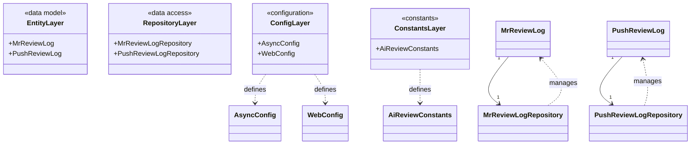
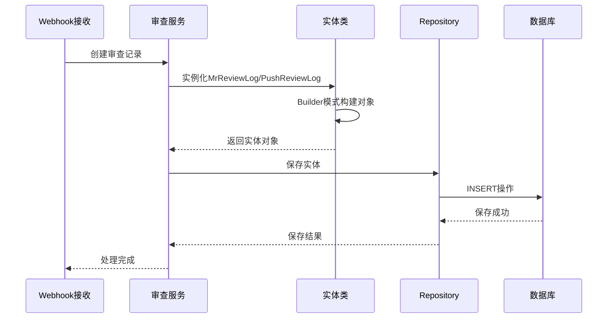
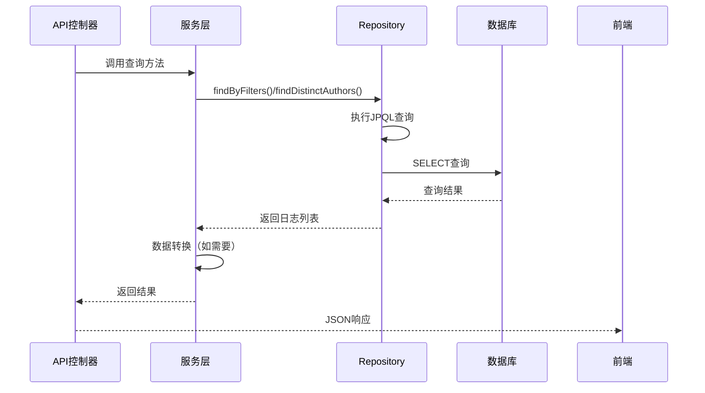

# 《智能代码审查系统》编码实现-第01节：项目基础模型与配置类的设计与实现

作者：冰河
<br/>星球：[http://m6z.cn/6aeFbs](http://m6z.cn/6aeFbs)
<br/>博客：[https://binghe.site](https://binghe.site)
<br/>文章汇总：[https://binghe.site/md/all/all.html](https://binghe.site/md/all/all.html)
<br/>源码获取地址：[https://t.zsxq.com/UIr1U](https://t.zsxq.com/UIr1U)

> 沉淀，成长，突破，帮助他人，成就自我。

**大家好，我是冰河~~**

AI智能代码审查系统是一个基于Spring Boot的自动化代码审查平台，通过集成大语言模型（LLM）对Git代码变更进行智能审查。系统支持多种编程语言、Git平台和通知渠道，目标是实现代码质量的自动化检测与反馈。经过前面需求设计和架构设计篇章的内容，相信小伙伴们对AI智能代码审查系统有了一个整体的认识。接下来，我们就进入编码实现阶段，首先，对AI智能代码审查系统的基础模型和配置类进行设计和实现。

当前为系统实现的第一个阶段，完成基础数据结构和配置组件的搭建，为后续业务逻辑开发提供支撑。

## 一、总体类设计

### 1.1 JPA实体设计

通过实体类学习JPA的实体映射规范：

- **@Entity**：标识为JPA实体，映射数据库表
- **@Table**：指定表名
- **@Id + @GeneratedValue**：主键自增策略
- **@Column**：字段映射与约束配置
- **@Builder**：构建器模式，创建不可变对象
- **@NoArgsConstructor + @AllArgsConstructor**：构造函数规范
- **@Data**：Lombok注解，自动生成getter/setter

### 1.2 数据访问层设计

通过Repository接口学习Spring Data JPA：

- 继承`JpaRepository<T, ID>`获得基础CRUD方法
- 使用`@Query`编写自定义JPQL查询
- 使用`@Param`绑定命名参数
- 支持可选参数（null检查）
- 聚合查询方法设计

### 1.3 系统配置设计

通过配置类学习Spring配置机制：

- **@Configuration**：标识配置类
- **@Bean**：声明Spring管理的Bean
- **@EnableAsync**：启用异步支持
- **ThreadPoolTaskExecutor**：线程池任务执行器
- **WebMvcConfigurer**：Web MVC配置接口

### 1.4 设计模式应用

- **Builder模式**：实体对象构建
- **常量类模式**：统一管理业务常量
- **线程池模式**：异步任务执行
- **Repository模式**：数据访问抽象

## 二、类实现关系图



## 三、数据流设计

### 3.1 审查记录保存流程



### 3.2 审查记录查询流程



## 四、代码实现详解

### 4.1 异步配置类（AsyncConfig）

**文件路径**：`src/main/java/io/binghe/ai/review/config/AsyncConfig.java`

**完整代码**：

```java
package io.binghe.ai.review.config;

import org.springframework.context.annotation.Bean;
import org.springframework.context.annotation.Configuration;
import org.springframework.scheduling.concurrent.ThreadPoolTaskExecutor;

import java.util.concurrent.Executor;

/**
 * 异步配置类
 * 配置异步任务执行线程池，为系统中的异步操作提供线程资源
 *
 * @author binghe(微信 : hacker_binghe)
 * @version 1.0.0
 * @description 异步配置类
 * @github https://github.com/binghe001
 * @copyright 公众号: 冰河技术
 */
@Configuration
public class AsyncConfig {

    /**
     * 配置异步任务线程池
     * 使用Spring的ThreadPoolTaskExecutor实现
     *
     * @return Executor 线程池执行器
     */
    @Bean(name = "taskExecutor")
    public Executor taskExecutor() {
        ThreadPoolTaskExecutor executor = new ThreadPoolTaskExecutor();
        // 核心线程数：线程池保持的最小线程数
        executor.setCorePoolSize(5);
        // 最大线程数：线程池允许的最大线程数
        executor.setMaxPoolSize(20);
        // 队列容量：等待执行的任务队列大小
        executor.setQueueCapacity(100);
        // 线程名前缀：标识线程来源，便于监控和日志排查
        executor.setThreadNamePrefix("ai-review-");
        // 初始化线程池
        executor.initialize();
        return executor;
    }
}
```

**配置参数说明**：

| 参数             | 值         | 说明                                            |
| ---------------- | ---------- | ----------------------------------------------- |
| corePoolSize     | 5          | 核心线程数，空闲时保持存活                      |
| maxPoolSize      | 20         | 最大线程数，超过核心线程数的任务进入队列        |
| queueCapacity    | 100        | 队列容量，队列满时创建新线程（最多maxPoolSize） |
| threadNamePrefix | ai-review- | 线程名前缀，用于识别线程来源                    |

**线程池工作原理**：

1. **核心线程创建**：线程池启动时创建核心线程（5个）
2. **任务提交**：
   - 任务数 < corePoolSize：创建新线程执行
   - 任务数 ≥ corePoolSize：进入队列等待
3. **队列满处理**：
   - 线程数 < maxPoolSize：创建新线程执行
   - 线程数 ≥ maxPoolSize：拒绝任务（默认AbortPolicy）

**使用场景**：

- Webhook事件异步处理
- LLM API调用（耗时较长）
- 通知消息异步发送
- 日报生成定时任务

### 4.2 Web配置类（WebConfig）

**文件路径**：`src/main/java/io/binghe/ai/review/config/WebConfig.java`

**完整代码**：

```java
package io.binghe.ai.review.config;

import org.springframework.context.annotation.Configuration;
import org.springframework.web.servlet.config.annotation.ResourceHandlerRegistry;
import org.springframework.web.servlet.config.annotation.WebMvcConfigurer;

/**
 * Web配置类
 * 配置Web应用的静态资源处理
 *
 * @author binghe(微信 : hacker_binghe)
 * @version 1.0.0
 * @description Web配置
 * @github https://github.com/binghe001
 * @copyright 公众号: 冰河技术
 */
@Configuration
public class WebConfig implements WebMvcConfigurer {

    /**
     * 添加静态资源处理器
     * 配置静态资源映射路径和位置
     *
     * @param registry 资源处理器注册表
     */
    @Override
    public void addResourceHandlers(ResourceHandlerRegistry registry) {
        // 映射路径：/** 表示匹配所有路径
        registry.addResourceHandler("/**")
                // 资源位置：classpath:/static/ 目录
                .addResourceLocations("classpath:/static/");
    }
}
```

**配置说明**：

## 查看完整文章

加入[冰河技术](https://public.zsxq.com/groups/48848484411888.html)知识星球，解锁完整技术文章、小册、视频与完整代码

## 写在最后

在冰河技术知识星球， **《AI智能代码审查平台》、《AI全链路短剧生成平台》** 已完结，同时，**《企业级微服务开放平台》** 项目热更中，还有其他二十几个项目，像实战Claude Code、AI知识库系统、智流助手平台、智能成语挑战赛项目、多轮AI智能对话系统、一站式AI智能平台、AI智能客服系统、AI智能问答系统、实战AI大模型、手写高性能敏组件、手写线程池、手写高性能SQL引擎、手写高性能Polaris网关、手写高性能熔断组件、手写通用指标上报组件、手写高性能数据库路由组件、手写分布式IM即时通讯系统、手写Seckill分布式秒杀系统、手写高性能RPC、实战高并发设计模式、简易商城系统等等。

这些项目的需求、方案、架构、落地等均来自互联网真实业务场景，让你真正学到互联网大厂的业务与技术落地方案，并将其有效转化为自己的知识储备。

**值得一提的是：冰河自研的Polaris高性能网关比某些开源网关项目性能更高，目前正在热更AI一体化项目，也正在实现MCP，全程带你分析原理和手撸代码。**

你还在等啥？不少小伙伴经过星球硬核技术和项目的历练，早已成功跳槽加薪，实现薪资翻倍，而你，还在原地踏步，抱怨大环境不好。抛弃焦虑和抱怨，我们一起塌下心来沉淀硬核技术和项目，让自己的薪资更上一层楼。

🚀PS：**目前已开通最大优惠：长按或扫码加入星球立减30，注意：随着项目和专栏的更新，星球也即将涨价！！**

<div align="center">
    
    <div style="font-size: 18px;"></div>
    <br/>
</div>

目前，领券加入星球就可以跟冰河一起学习《实战Claude Code》、《多轮AI智能对话系统》、《一站式AI智能平台》、《AI智能客服系统》、《AI智能问答系统》、《实战AI大模型》、《手写高性能Redis组件》、《手写高性能脱敏组件》、《手写线程池》、《手写高性能SQL引擎》、《手写高性能Polaris网关》、《手写高性能RPC项目》、《分布式Seckill秒杀系统》、《分布式IM即时通讯系统》《手写高性能通用熔断组件项目》、《手写高性能通用监控指标上报组件》、《手写高性能数据库路由组件》、《手写简易商城脚手架项目》、《Spring6核心技术与源码解析》和《实战高并发设计模式》，从零开始介绍原理、设计架构、手撸代码。

**花很少的钱就能学这么多硬核技术、中间件项目和大厂秒杀系统、分布式IM即时通讯系统，AI大模型项目，比其他培训机构不知便宜多少倍，硬核多少倍，如果是我，我会买他个十年！**

加入要趁早，后续还会随着项目和加入的人数涨价，而且只会涨，不会降，先加入的小伙伴就是赚到。

另外，还有一个限时福利，邀请一个小伙伴加入，冰河就会给一笔 **分享有奖** ，有些小伙伴都邀请了50+人，早就回本了！

## 其他方式加入星球

- **链接** ：打开链接 http://m6z.cn/6aeFbs 加入星球。
- **回复** ：在公众号 **冰河技术** 回复 **星球** 领取优惠券加入星球。

**特别提醒：** 苹果用户进圈或续费，请加微信 **hacker_binghe** 扫二维码，或者去公众号 **冰河技术** 回复 **星球** 扫二维码加入星球。

**好了，今天就到这儿吧，我是冰河，我们下期见~~**