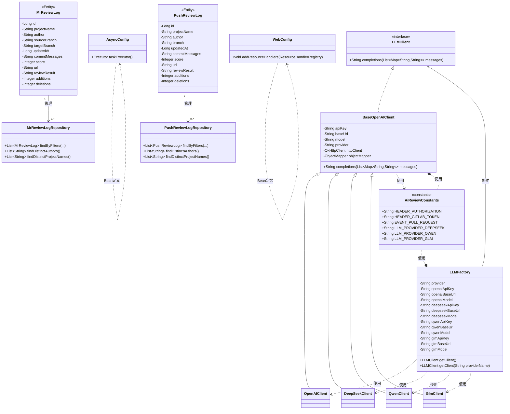
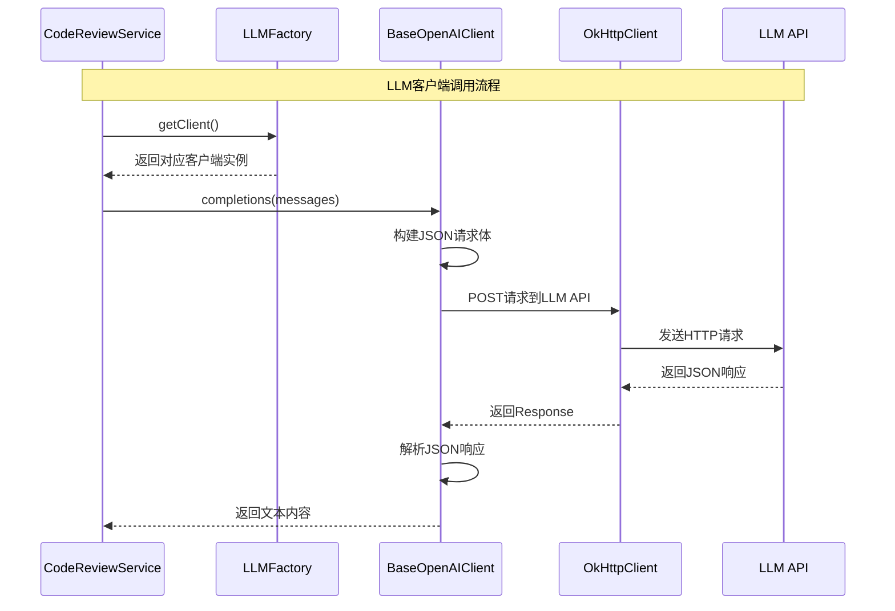
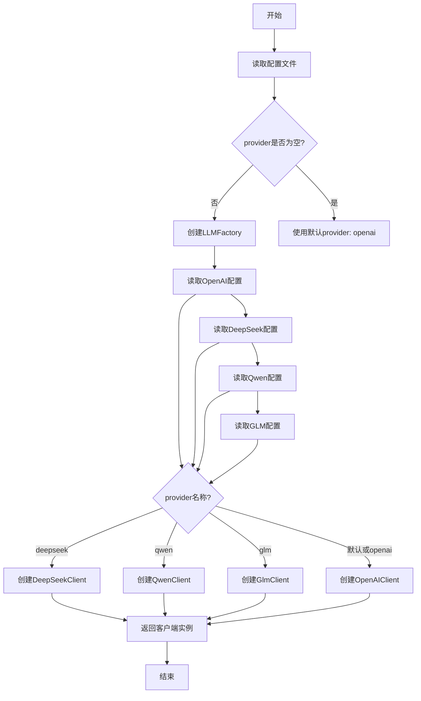
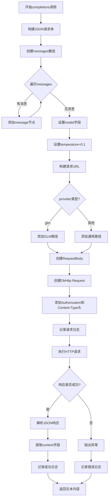

# 《智能代码审查系统》编码实现-第02节：对接各种AI大模型客户端

作者：冰河
 星球：[http://m6z.cn/6aeFbs](http://m6z.cn/6aeFbs)
 博客：[https://binghe.site](https://binghe.site)
 文章汇总：[https://binghe.site/md/all/all.html](https://binghe.site/md/all/all.html)
 源码获取地址：[https://t.zsxq.com/UIr1U](https://t.zsxq.com/UIr1U)

> 沉淀，成长，突破，帮助他人，成就自我。

**大家好，我是冰河~~**

上一节我们把项目的基础设施搭好了：异步线程池、Web 静态资源配置、全局常量、两个实体类以及对应的 Repository。说白了，就是让项目能跑起来，能存数据。

但我们的核心目标是“智能代码审查”，没有大模型怎么行？这一节就来干正事：**实现 AI 大模型客户端层**。

目前我们打算对接的模型有：OpenAI（GPT-3.5/4/5）、DeepSeek、智谱 GLM、通义千问。这几家 API 长得不太一样，但核心都是发 HTTP 请求、收 JSON、取 content。所以一定要抽象出一层，让上层代码不关心具体用的是哪家模型。

## 一、整体进展回顾

在开始之前，先快速回顾一下项目目前的状态。

**目前已完成**：

- `AsyncConfig`：线程池配置，核心 5 线程，最大 20，队列 100
- `WebConfig`：静态资源映射到 `classpath:/static/`
- `AiReviewConstants`：全局常量，避免魔法值
- `MrReviewLog` 和 `PushReviewLog`：两个实体类，Builder 模式
- `MrReviewLogRepository` 和 `PushReviewLogRepository`：数据访问层，支持多条件过滤和去重查询

**本节要完成**：
- LLM 客户端统一接口 `LLMClient`
- 抽象基类 `BaseOpenAIClient`（封装 HTTP 调用、超时、JSON 解析）
- 四个具体实现：`OpenAIClient`、`DeepSeekClient`、`QwenClient`、`GlmClient`
- 工厂类 `LLMFactory`，根据配置动态创建对应的客户端

## 二、为什么要设计一个独立的客户端层

在实际开发中，我们可能会因为成本、速度、稳定性等原因切换不同的模型。比如：
- 日常开发用 DeepSeek（便宜，够用）
- 核心模块用 GPT-4（更准确）
- 国内部署用通义千问或 GLM（合规）

如果代码里到处是 `new OpenAIClient(...)`，换模型时得改十几个文件，太痛苦。所以我们做了一层抽象：

- **统一接口** `LLMClient`：不管底层是谁，上层只需要调用 `completions(messages)` 拿结果。
- **工厂模式** `LLMFactory`：根据配置文件 `llm.provider` 的值，自动给你返回对应的客户端实例。
- **模板方法** `BaseOpenAIClient`：把 HTTP 请求、超时、重试、JSON 解析等通用逻辑写在基类里，各个子类几乎不需要写代码（除了构造函数）。

这样一来，上层业务代码（比如 `CodeReviewService`）只需要注入 `LLMFactory`，然后 `llmFactory.getClient()` 就能拿到当前配置的客户端，完全不知道底层是谁。

## 三、核心类实现关系

这张图里上半部分是 **LLM 客户端层**（接口→抽象基类→四个具体实现→工厂），中间偏右是**实体和 Repository**，下面是**配置和常量**。整体分层很清楚。

## 四、LLM 客户端调用流程

先看一张时序图，理解一个完整的审查请求是如何从业务代码走到具体模型 API 的：

简单说就是：业务层拿到客户端 → 调用 `completions` → 基类负责拼 JSON、发请求、解析 → 返回纯文本。

## 五、工厂创建客户端的决策流程

`LLMFactory` 怎么决定创建哪个客户端？看下面这张图：

实际代码中就是 switch 表达式，很直观。

## 六、BaseOpenAIClient 的请求构建细节

抽象基类里面做了哪些事？我画了张流程图：

其中有个小坑：智谱 GLM 的 chat 接口路径不是标准的 `/chat/completions`，而是 `/api/anthropic`，所以我们在 `CheckProvider` 那里特殊处理了一下。

## 七、核心代码实现

### 7.1 统一接口：LLMClient

## 查看完整文章

加入[冰河技术](https://public.zsxq.com/groups/48848484411888.html)知识星球，解锁完整技术文章、小册、视频与完整代码

## 写在最后

在冰河技术知识星球， **《AI智能代码审查平台》、《AI全链路短剧生成平台》** 已完结，同时，**《企业级微服务开放平台》** 项目热更中，还有其他二十几个项目，像实战Claude Code、AI知识库系统、智流助手平台、智能成语挑战赛项目、多轮AI智能对话系统、一站式AI智能平台、AI智能客服系统、AI智能问答系统、实战AI大模型、手写高性能敏组件、手写线程池、手写高性能SQL引擎、手写高性能Polaris网关、手写高性能熔断组件、手写通用指标上报组件、手写高性能数据库路由组件、手写分布式IM即时通讯系统、手写Seckill分布式秒杀系统、手写高性能RPC、实战高并发设计模式、简易商城系统等等。

这些项目的需求、方案、架构、落地等均来自互联网真实业务场景，让你真正学到互联网大厂的业务与技术落地方案，并将其有效转化为自己的知识储备。

**值得一提的是：冰河自研的Polaris高性能网关比某些开源网关项目性能更高，目前正在热更AI一体化项目，也正在实现MCP，全程带你分析原理和手撸代码。**

你还在等啥？不少小伙伴经过星球硬核技术和项目的历练，早已成功跳槽加薪，实现薪资翻倍，而你，还在原地踏步，抱怨大环境不好。抛弃焦虑和抱怨，我们一起塌下心来沉淀硬核技术和项目，让自己的薪资更上一层楼。

🚀PS：**目前已开通最大优惠：长按或扫码加入星球立减30，注意：随着项目和专栏的更新，星球也即将涨价！！**

    
    

     

目前，领券加入星球就可以跟冰河一起学习《实战Claude Code》、《多轮AI智能对话系统》、《一站式AI智能平台》、《AI智能客服系统》、《AI智能问答系统》、《实战AI大模型》、《手写高性能Redis组件》、《手写高性能脱敏组件》、《手写线程池》、《手写高性能SQL引擎》、《手写高性能Polaris网关》、《手写高性能RPC项目》、《分布式Seckill秒杀系统》、《分布式IM即时通讯系统》《手写高性能通用熔断组件项目》、《手写高性能通用监控指标上报组件》、《手写高性能数据库路由组件》、《手写简易商城脚手架项目》、《Spring6核心技术与源码解析》和《实战高并发设计模式》，从零开始介绍原理、设计架构、手撸代码。

**花很少的钱就能学这么多硬核技术、中间件项目和大厂秒杀系统、分布式IM即时通讯系统，AI大模型项目，比其他培训机构不知便宜多少倍，硬核多少倍，如果是我，我会买他个十年！**

加入要趁早，后续还会随着项目和加入的人数涨价，而且只会涨，不会降，先加入的小伙伴就是赚到。

另外，还有一个限时福利，邀请一个小伙伴加入，冰河就会给一笔 **分享有奖** ，有些小伙伴都邀请了50+人，早就回本了！

## 其他方式加入星球

- **链接** ：打开链接 http://m6z.cn/6aeFbs 加入星球。
- **回复** ：在公众号 **冰河技术** 回复 **星球** 领取优惠券加入星球。

**特别提醒：** 苹果用户进圈或续费，请加微信 **hacker_binghe** 扫二维码，或者去公众号 **冰河技术** 回复 **星球** 扫二维码加入星球。

**好了，今天就到这儿吧，我是冰河，我们下期见~~**