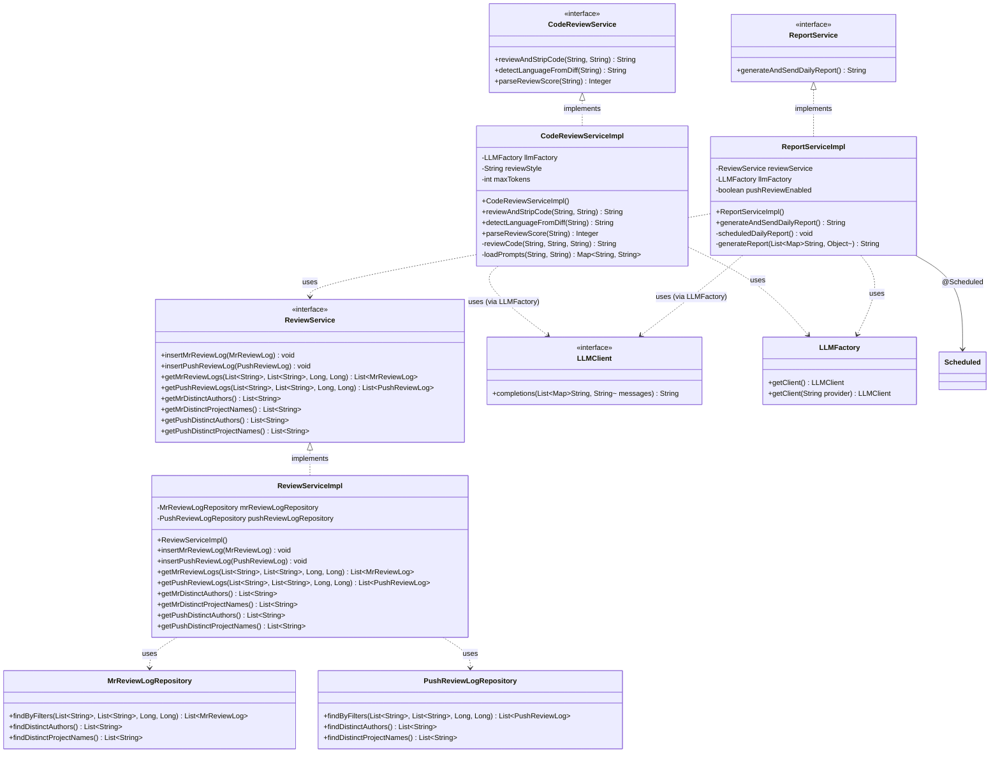
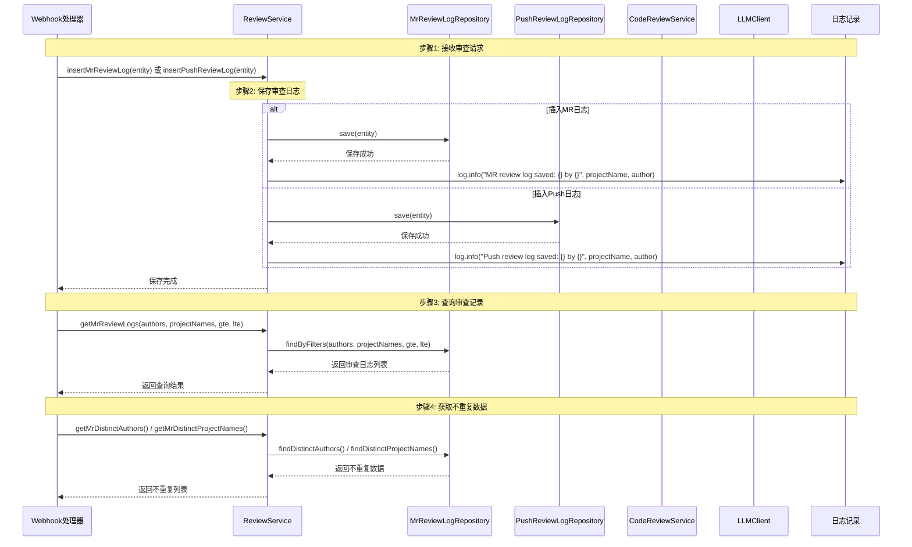
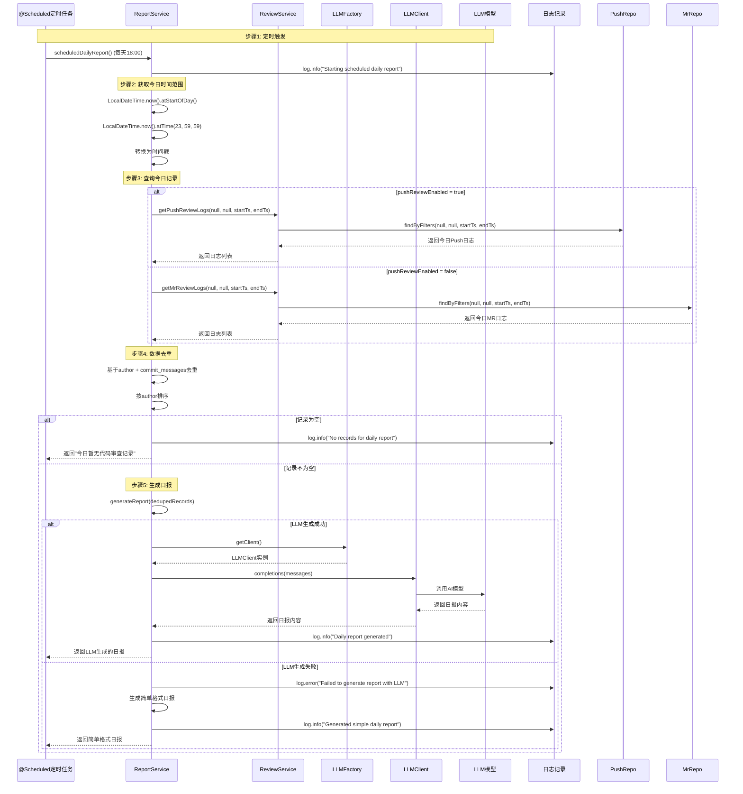

# 《智能代码审查系统》编码实现-第04节：生成CR记录和日报的设计与实现

作者：冰河
<br/>星球：[http://m6z.cn/6aeFbs](http://m6z.cn/6aeFbs)
<br/>博客：[https://binghe.site](https://binghe.site)
<br/>文章汇总：[https://binghe.site/md/all/all.html](https://binghe.site/md/all/all.html)
<br/>源码获取地址：[https://t.zsxq.com/UIr1U](https://t.zsxq.com/UIr1U)

> 沉淀，成长，突破，帮助他人，成就自我。

**大家好，我是冰河~~**

经过前面几个章节的实现，又完善了AI智能代码审查系统的CodeReview服务层的功能，接下来，我们继续设计和实现生成CR记录和日报的功能。

## 一、整体进展回顾

在开始之前，先快速回顾一下项目目前的状态。

### 1.1 实现进展与规划

**目前已完成**：

```java
配置与数据层（已完成）
    ├── AsyncConfig - 异步配置
    ├── WebConfig - Web配置
    ├── AiReviewConstants - 常量定义
    ├── MrReviewLog - MR审查日志实体
    ├── PushReviewLog - Push审查日志实体
    └── Repository层 - 数据访问层

LLM客户端层（已完成）
    ├── BaseOpenAIClient - 基础客户端
    ├── LLMClient - 统一接口
    ├── LLMFactory - 工厂类
    ├── OpenAIClient - OpenAI实现
    ├── DeepSeekClient - DeepSeek实现
    ├── QwenClient - Qwen实现
    └── GlmClient - GLM实现

CodeReview服务层（已完成）
    ├── CodeReviewService - 代码审查服务接口
    └── CodeReviewServiceImpl - 代码审查服务实现
```

**本节要完成**：

```java
Review与Report服务层（已完成）
    ├── ReviewService - 审查记录服务接口
    ├── ReviewServiceImpl - 审查记录服务实现
    ├── ReportService - 日报服务接口
    └── ReportServiceImpl - 日报服务实现
```

### 1.2 实现详情

#### 1.2.1 实现内容

本阶段实现Review和Report服务的核心功能：

**新增文件**:

- `io.binghe.ai.review.service.ReviewService` - 审查记录服务接口
- `io.binghe.ai.review.service.impl.ReviewServiceImpl` - 审查记录服务实现
- `io.binghe.ai.review.service.ReportService` - 日报服务接口
- `io.binghe.ai.review.service.impl.ReportServiceImpl` - 日报服务实现

**核心功能**:

1. 审查记录的增删改查（ReviewService）
2. 日报的定时生成与LLM生成
3. 数据去重与统计分析
4. 降级处理策略

#### 1.2.2 关键技术点

- **定时任务**: @Scheduled注解配置日报生成时间
- **LLM生成日报**: 使用LLMClient调用AI生成结构化日报
- **数据去重**: 基于author和commit_messages组合去重
- **降级策略**: LLM失败时使用简单格式生成日报
- **时间范围查询**: 今日时间范围自动计算
- **多审查类型支持**: MR和Push两种审查类型

## 二、类实现关系

### 2.1 整体类关系图

```mermaid
classDiagram
    %% 配置层
    class AsyncConfig {
        +configureAsyncExecutor() ThreadPoolTaskExecutor
    }

    class WebConfig {
        +WebMvcConfigurer configure()
    }

    %% 常量层
    class AiReviewConstants {
        <<utility>>
        +LLM_PROVIDER_OPENAI
        +LLM_PROVIDER_DEEPSEEK
        +LLM_PROVIDER_QWEN
        +LLM_PROVIDER_GLM
        +FILE_EXT_PY
        +FILE_EXT_JS
        +LANG_PYTHON
        +LANG_JAVASCRIPT
        +JSON_FIELD_USER_PROMPT
        +JSON_FIELD_SYSTEM_PROMPT
        +LLM_FIELD_ROLE
        +LLM_FIELD_CONTENT
        +LLM_ROLE_SYSTEM
        +LLM_ROLE_USER
        +PROMPT_KEY_PYTHON
        +PROMPT_KEY_DEFAULT
    }

    %% 实体层
    class MrReviewLog {
        +Long id
        +String repoName
        +Long pullRequestId
        +String repoUrl
        +String targetBranch
        +String sourceBranch
        +String author
        +String reviewResult
        +Integer score
        +LocalDateTime createdAt
    }

    class PushReviewLog {
        +Long id
        +String repoName
        +String branch
        +String author
        +String reviewResult
        +Integer score
        +LocalDateTime createdAt
    }

    %% 数据访问层
    class MrReviewLogRepository {
        +List~MrReviewLog~ findByRepoName(String repoName)
        +List~MrReviewLog~ findByPullRequestId(Long id)
        +List~MrReviewLog~ findByAuthor(String author)
        +List~MrReviewLog~ findByCreatedAtBetween(LocalDateTime start, LocalDateTime end)
        +Double getAverageScoreByRepoName(String repoName)
        +Map~String, Integer~ getScoreDistribution(String repoName)
        +List~MrReviewLog~ findByFilters(List~String~ authors, List~String~ projectNames, Long gte, Long lte)
        +List~String~ findDistinctAuthors()
        +List~String~ findDistinctProjectNames()
    }

    class PushReviewLogRepository {
        +List~PushReviewLog~ findByRepoName(String repoName)
        +List~PushReviewLog~ findByBranch(String branch)
        +List~PushReviewLog~ findByAuthor(String author)
        +List~PushReviewLog~ findByCreatedAtBetween(LocalDateTime start, LocalDateTime end)
        +Double getAverageScoreByRepoName(String repoName)
        +Map~String, Integer~ getScoreDistribution(String repoName)
        +List~PushReviewLog~ findByFilters(List~String~ authors, List~String~ projectNames, Long gte, Long lte)
        +List~String~ findDistinctAuthors()
        +List~String~ findDistinctProjectNames()
    }

    %% LLM集成层
    class LLMClient {
        <<interface>>
        +completions(List~Map~String, String~ messages) String
    }

    class LLMFactory {
        +getClient() LLMClient
        +getClient(String provider) LLMClient
    }

    class BaseOpenAIClient {
        -String baseUrl
        -String apiKey
        -String model
        -int timeout
        +BaseOpenAIClient(String baseUrl, String apiKey, String model, int timeout)
        +createHttpClient() OkHttpClient
        +makeRequest(String url, Map~String, Object~ body) String
    }

    class OpenAIClient {
        -String baseUrl
        -String apiKey
        -String model
        +OpenAIClient(String baseUrl, String apiKey, String model)
        +completions(List~Map~String, String~ messages) String
    }

    class DeepSeekClient {
        -String baseUrl
        -String apiKey
        -String model
        +DeepSeekClient(String baseUrl, String apiKey, String model)
        +completions(List~Map~String, String~ messages) String
    }

    class QwenClient {
        -String baseUrl
        -String apiKey
        -String model
        +QwenClient(String baseUrl, String apiKey, String model)
        +completions(List~Map~String, String~ messages) String
    }

    class GlmClient {
        -String baseUrl
        -String apiKey
        -String model
        +GlmClient(String baseUrl, String apiKey, String model)
        +completions(List~Map~String, String~ messages) String
    }

    %% 服务层
    class CodeReviewService {
        <<interface>>
        +reviewAndStripCode(String changesText, String commitsText) String
        +detectLanguageFromDiff(String diffsText) String
        +parseReviewScore(String reviewText) Integer
    }

    class CodeReviewServiceImpl {
        -LLMFactory llmFactory
        -String reviewStyle
        -int maxTokens
        -Map~String, String~ FILE_EXT_TO_LANG
        -Map~String, String~ LANG_TO_PROMPT_KEY
        +CodeReviewServiceImpl()
        +reviewAndStripCode(String, String) String
        +detectLanguageFromDiff(String) String
        +parseReviewScore(String) Integer
        -reviewCode(String, String, String) String
        -loadPrompts(String, String) Map~String, String~
        -processTemplate(String, String) String
        -processStyleConditions(String, String) String
        -resolveConditionBlock(String, String) String
    }

    class ReviewService {
        <<interface>>
        +insertMrReviewLog(MrReviewLog entity) void
        +insertPushReviewLog(PushReviewLog entity) void
        +getMrReviewLogs(List~String~ authors, List~String~ projectNames, Long, Long) List~MrReviewLog~
        +getPushReviewLogs(List~String~ authors, List~String~ projectNames, Long, Long) List~PushReviewLog~
        +getMrDistinctAuthors() List~String~
        +getMrDistinctProjectNames() List~String~
        +getPushDistinctAuthors() List~String~
        +getPushDistinctProjectNames() List~String~
    }

    class ReviewServiceImpl {
        -MrReviewLogRepository mrReviewLogRepository
        -PushReviewLogRepository pushReviewLogRepository
        +ReviewServiceImpl()
        +insertMrReviewLog(MrReviewLog) void
        +insertPushReviewLog(PushReviewLog) void
        +getMrReviewLogs(List~String~, List~String~, Long, Long) List~MrReviewLog~
        +getPushReviewLogs(List~String~, List~String~, Long, Long) List~PushReviewLog~
        +getMrDistinctAuthors() List~String~
        +getMrDistinctProjectNames() List~String~
        +getPushDistinctAuthors() List~String~
        +getPushDistinctProjectNames() List~String~
    }

    class ReportService {
        <<interface>>
        +generateAndSendDailyReport() String
    }

    class ReportServiceImpl {
        -ReviewService reviewService
        -LLMFactory llmFactory
        -boolean pushReviewEnabled
        +ReportServiceImpl()
        +generateAndSendDailyReport() String
        -scheduledDailyReport() void
        -generateReport(List~Map~String, Object~) String
    }

    %% 关系
    LLMClient <|.. OpenAIClient : implements
    LLMClient <|.. DeepSeekClient : implements
    LLMClient <|.. QwenClient : implements
    LLMClient <|.. GlmClient : implements

    OpenAIClient --|> BaseOpenAIClient : extends
    DeepSeekClient --|> BaseOpenAIClient : extends
    QwenClient --|> BaseOpenAIClient : extends
    GlmClient --|> BaseOpenAIClient : extends

    LLMFactory ..> LLMClient : creates
    LLMFactory ..> OpenAIClient : creates
    LLMFactory ..> DeepSeekClient : creates
    LLMFactory ..> QwenClient : creates
    LLMFactory ..> GlmClient : creates

    CodeReviewService <|.. CodeReviewServiceImpl : implements
    ReviewService <|.. ReviewServiceImpl : implements
    ReportService <|.. ReportServiceImpl : implements

    CodeReviewServiceImpl ..> LLMFactory : uses
    CodeReviewServiceImpl ..> LLMClient : uses (via LLMFactory)
    CodeReviewServiceImpl ..> AiReviewConstants : uses (constants)

    ReviewServiceImpl ..> MrReviewLogRepository : uses
    ReviewServiceImpl ..> PushReviewLogRepository : uses

    ReportServiceImpl ..> ReviewService : uses
    ReportServiceImpl ..> LLMFactory : uses
    ReportServiceImpl ..> LLMClient : uses (via LLMFactory)

    AiReviewConstants ..> MrReviewLog : references
    AiReviewConstants ..> PushReviewLog : references

    MrReviewLogRepository --> MrReviewLog : manages
    PushReviewLogRepository --> PushReviewLog : manages

    AsyncConfig ..> ThreadPoolTaskExecutor : configures
    WebConfig ..> WebMvcConfigurer : configures

    ReportServiceImpl ..> Scheduled : annotation
```



### 2.2 Service包类关系图



## 三、执行流程

### 3.1 审查记录CRUD流程



### 3.2 日报生成流程



### 3.3 日报生成详细流程

## 查看完整文章

加入[冰河技术](https://public.zsxq.com/groups/48848484411888.html)知识星球，解锁完整技术文章、小册、视频与完整代码

## 写在最后

在冰河技术知识星球， **《AI智能代码审查平台》、《AI全链路短剧生成平台》** 已完结，同时，**《企业级微服务开放平台》** 项目热更中，还有其他二十几个项目，像实战Claude Code、AI知识库系统、智流助手平台、智能成语挑战赛项目、多轮AI智能对话系统、一站式AI智能平台、AI智能客服系统、AI智能问答系统、实战AI大模型、手写高性能敏组件、手写线程池、手写高性能SQL引擎、手写高性能Polaris网关、手写高性能熔断组件、手写通用指标上报组件、手写高性能数据库路由组件、手写分布式IM即时通讯系统、手写Seckill分布式秒杀系统、手写高性能RPC、实战高并发设计模式、简易商城系统等等。

这些项目的需求、方案、架构、落地等均来自互联网真实业务场景，让你真正学到互联网大厂的业务与技术落地方案，并将其有效转化为自己的知识储备。

**值得一提的是：冰河自研的Polaris高性能网关比某些开源网关项目性能更高，目前正在热更AI一体化项目，也正在实现MCP，全程带你分析原理和手撸代码。**

你还在等啥？不少小伙伴经过星球硬核技术和项目的历练，早已成功跳槽加薪，实现薪资翻倍，而你，还在原地踏步，抱怨大环境不好。抛弃焦虑和抱怨，我们一起塌下心来沉淀硬核技术和项目，让自己的薪资更上一层楼。

🚀PS：**目前已开通最大优惠：长按或扫码加入星球立减30，注意：随着项目和专栏的更新，星球也即将涨价！！**

<div align="center">
    
    <div style="font-size: 18px;"></div>
    <br/>
</div>

目前，领券加入星球就可以跟冰河一起学习《实战Claude Code》、《多轮AI智能对话系统》、《一站式AI智能平台》、《AI智能客服系统》、《AI智能问答系统》、《实战AI大模型》、《手写高性能Redis组件》、《手写高性能脱敏组件》、《手写线程池》、《手写高性能SQL引擎》、《手写高性能Polaris网关》、《手写高性能RPC项目》、《分布式Seckill秒杀系统》、《分布式IM即时通讯系统》《手写高性能通用熔断组件项目》、《手写高性能通用监控指标上报组件》、《手写高性能数据库路由组件》、《手写简易商城脚手架项目》、《Spring6核心技术与源码解析》和《实战高并发设计模式》，从零开始介绍原理、设计架构、手撸代码。

**花很少的钱就能学这么多硬核技术、中间件项目和大厂秒杀系统、分布式IM即时通讯系统，AI大模型项目，比其他培训机构不知便宜多少倍，硬核多少倍，如果是我，我会买他个十年！**

加入要趁早，后续还会随着项目和加入的人数涨价，而且只会涨，不会降，先加入的小伙伴就是赚到。

另外，还有一个限时福利，邀请一个小伙伴加入，冰河就会给一笔 **分享有奖** ，有些小伙伴都邀请了50+人，早就回本了！

## 其他方式加入星球

- **链接** ：打开链接 http://m6z.cn/6aeFbs 加入星球。
- **回复** ：在公众号 **冰河技术** 回复 **星球** 领取优惠券加入星球。

**特别提醒：** 苹果用户进圈或续费，请加微信 **hacker_binghe** 扫二维码，或者去公众号 **冰河技术** 回复 **星球** 扫二维码加入星球。

**好了，今天就到这儿吧，我是冰河，我们下期见~~**