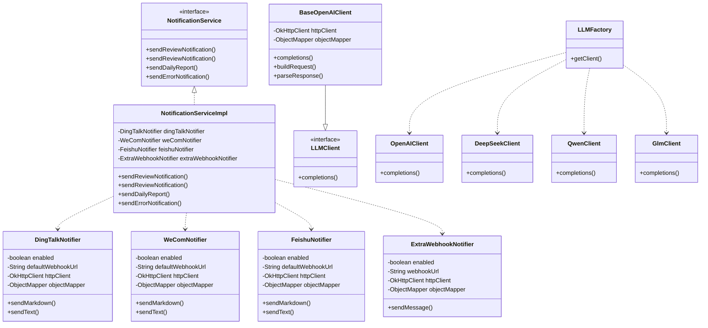
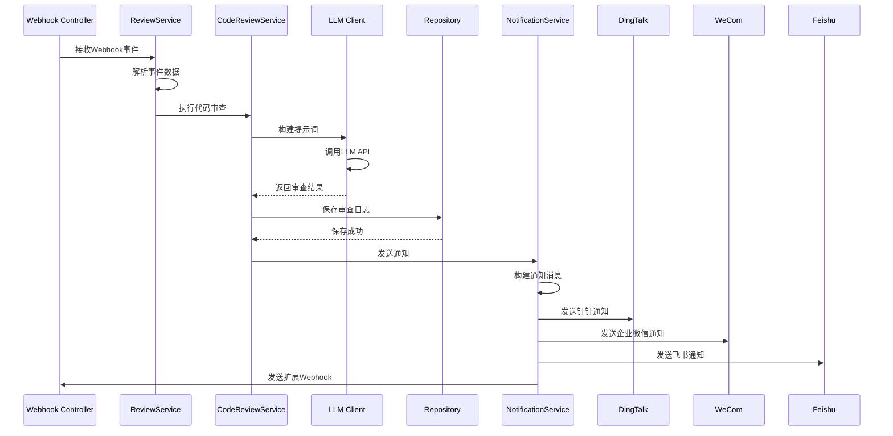
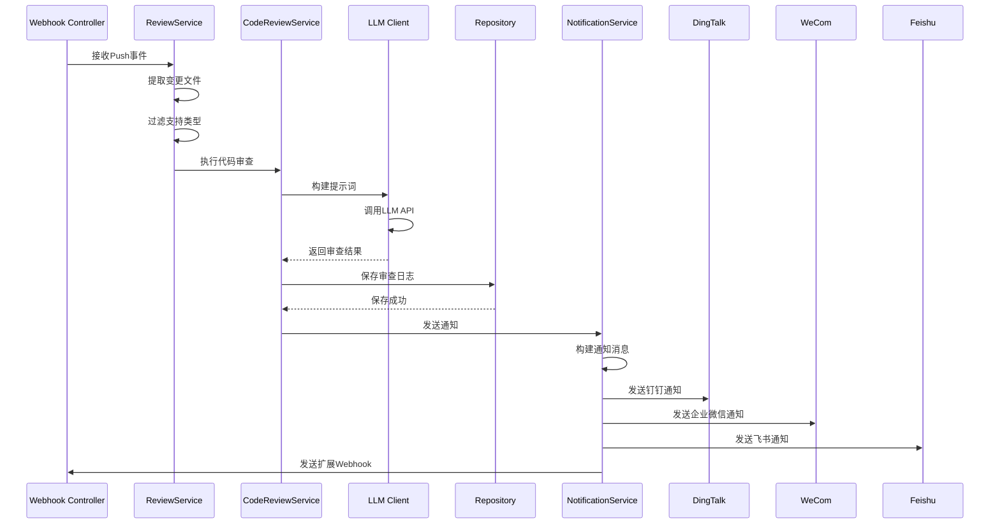
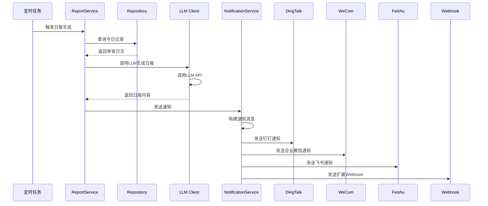

# 《智能代码审查系统》编码实现-第05节：对接微信-钉钉-飞书-自定义WebHook发送通知消息

作者：冰河
<br/>星球：[http://m6z.cn/6aeFbs](http://m6z.cn/6aeFbs)
<br/>博客：[https://binghe.site](https://binghe.site)
<br/>文章汇总：[https://binghe.site/md/all/all.html](https://binghe.site/md/all/all.html)
<br/>源码获取地址：[https://t.zsxq.com/UIr1U](https://t.zsxq.com/UIr1U)

> 沉淀，成长，突破，帮助他人，成就自我。

**大家好，我是冰河~~**

经过前面几个章节的实现，又完善了AI智能代码审查系统的CodeReview服务层的功能，并且能够生成CR记录和日报，接下来，我们继续设计和实现生成CR记录和日报的功能。

## 一、整体进展回顾

在开始之前，先快速回顾一下项目目前的状态。

### 第一阶段：基础配置与数据层（已完成）

- **AsyncConfig**: 异步任务线程池配置
  - 核心线程池：5个
  - 最大线程池：20个
  - 队列容量：100个

- **WebConfig**: Web MVC配置
  - 静态资源处理

- **AiReviewConstants**: 全局常量管理
  - HTTP请求头定义
  - Webhook事件类型
  - 审查类型标签
  - 业务消息常量
  - Markdown格式常量
  - 环境变量Key前缀（钉钉、企业微信、飞书）

- **数据实体与Repository**:
  - MrReviewLog: MR审查日志实体
  - PushReviewLog: Push审查日志实体
  - 使用Builder模式构建实体
  - 支持多条件过滤查询、聚合查询

### 第二阶段：LLM客户端层（已完成）

- **BaseOpenAIClient**: LLM客户端抽象基类
  - HTTP请求封装
  - 超时配置（连接30秒，读取30秒）
  - 重试逻辑
  - JSON响应解析

- **LLMClient**: 统一LLM接口
  - 定义completions标准方法

- **LLMFactory**: 客户端工厂类
  - 根据配置创建对应的LLM客户端
  - 支持OpenAI、DeepSeek、Qwen、GLM四种模型

- **四个具体实现**:
  - OpenAIClient: OpenAI API客户端
  - DeepSeekClient: DeepSeek API客户端
  - QwenClient: 通义千问API客户端
  - GlmClient: 智谱GLM API客户端

### 第三阶段：通知服务层（本节完成）

- **NotificationService**: 通知服务接口
  - sendReviewNotification: 发送代码审查结果通知（重载2个版本）
  - sendDailyReport: 发送日报通知
  - sendErrorNotification: 发送错误通知

- **NotificationServiceImpl**: 通知服务实现类
  - 集成4个Notifier实现多渠道通知
  - 统一构建通知消息格式
  - 支持Markdown和Text两种消息类型

- **四个Notifier实现**:
  - DingTalkNotifier: 钉钉通知器
  - WeComNotifier: 企业微信通知器
  - FeishuNotifier: 飞书通知器
  - ExtraWebhookNotifier: 扩展Webhook通知器

## 二、类实现关系

### 2.1 整体类关系图



### 2.2 MR代码审查流程



### 2.3 Push代码审查流程



### 2.4 日报生成流程



## 三、核心代码实现说明

### 3.1 NotificationService接口

NotificationService接口是发送微信、钉钉、飞书和自定义WebHook消息的核心接口。

源码详见：io.binghe.ai.review.messaging.NotificationService。

```java
package io.binghe.ai.review.messaging;

import java.util.Map;

/**
 * 通知服务接口
 * 定义了发送通知的统一方法
 */
public interface NotificationService {
    /**
     * 发送代码审查结果通知（基础版本）
     */
    void sendReviewNotification(String projectName, String author, String reviewType,
                                        String branch, String targetBranch, String reviewResult,
                                        Integer score, String url);

    /**
     * 发送代码审查结果通知（带项目路由和原始webhook数据）
     * 支持按项目名或URL slug路由不同的webhook URL
     */
    void sendReviewNotification(String projectName, String author, String reviewType,
                                        String branch, String targetBranch, String reviewResult,
                                        Integer score, String url, String urlSlug,
                                        Map<String, Object> webhookData);

    /**
     * 发送日报通知
     */
    void sendDailyReport(String reportContent);

    /**
     * 发送错误通知
     */
    void sendErrorNotification(String errorMessage);
}
```

### 3.2 NotificationServiceImpl实现类

核心实现要点：

1. 注入4个Notifier实现多渠道通知
2. 统一构建通知消息格式
3. 支持Markdown和Text两种消息类型
4. 处理消息长度限制和内容截断

源码详见：io.binghe.ai.review.messaging.impl.NotificationServiceImpl。

## 查看完整文章

加入[冰河技术](https://public.zsxq.com/groups/48848484411888.html)知识星球，解锁完整技术文章、小册、视频与完整代码

## 写在最后

在冰河技术知识星球， **《AI智能代码审查平台》、《AI全链路短剧生成平台》** 已完结，同时，**《企业级微服务开放平台》** 项目热更中，还有其他二十几个项目，像实战Claude Code、AI知识库系统、智流助手平台、智能成语挑战赛项目、多轮AI智能对话系统、一站式AI智能平台、AI智能客服系统、AI智能问答系统、实战AI大模型、手写高性能敏组件、手写线程池、手写高性能SQL引擎、手写高性能Polaris网关、手写高性能熔断组件、手写通用指标上报组件、手写高性能数据库路由组件、手写分布式IM即时通讯系统、手写Seckill分布式秒杀系统、手写高性能RPC、实战高并发设计模式、简易商城系统等等。

这些项目的需求、方案、架构、落地等均来自互联网真实业务场景，让你真正学到互联网大厂的业务与技术落地方案，并将其有效转化为自己的知识储备。

**值得一提的是：冰河自研的Polaris高性能网关比某些开源网关项目性能更高，目前正在热更AI一体化项目，也正在实现MCP，全程带你分析原理和手撸代码。**

你还在等啥？不少小伙伴经过星球硬核技术和项目的历练，早已成功跳槽加薪，实现薪资翻倍，而你，还在原地踏步，抱怨大环境不好。抛弃焦虑和抱怨，我们一起塌下心来沉淀硬核技术和项目，让自己的薪资更上一层楼。

🚀PS：**目前已开通最大优惠：长按或扫码加入星球立减30，注意：随着项目和专栏的更新，星球也即将涨价！！**

<div align="center">
    
    <div style="font-size: 18px;"></div>
    <br/>
</div>

目前，领券加入星球就可以跟冰河一起学习《实战Claude Code》、《多轮AI智能对话系统》、《一站式AI智能平台》、《AI智能客服系统》、《AI智能问答系统》、《实战AI大模型》、《手写高性能Redis组件》、《手写高性能脱敏组件》、《手写线程池》、《手写高性能SQL引擎》、《手写高性能Polaris网关》、《手写高性能RPC项目》、《分布式Seckill秒杀系统》、《分布式IM即时通讯系统》《手写高性能通用熔断组件项目》、《手写高性能通用监控指标上报组件》、《手写高性能数据库路由组件》、《手写简易商城脚手架项目》、《Spring6核心技术与源码解析》和《实战高并发设计模式》，从零开始介绍原理、设计架构、手撸代码。

**花很少的钱就能学这么多硬核技术、中间件项目和大厂秒杀系统、分布式IM即时通讯系统，AI大模型项目，比其他培训机构不知便宜多少倍，硬核多少倍，如果是我，我会买他个十年！**

加入要趁早，后续还会随着项目和加入的人数涨价，而且只会涨，不会降，先加入的小伙伴就是赚到。

另外，还有一个限时福利，邀请一个小伙伴加入，冰河就会给一笔 **分享有奖** ，有些小伙伴都邀请了50+人，早就回本了！

## 其他方式加入星球

- **链接** ：打开链接 http://m6z.cn/6aeFbs 加入星球。
- **回复** ：在公众号 **冰河技术** 回复 **星球** 领取优惠券加入星球。

**特别提醒：** 苹果用户进圈或续费，请加微信 **hacker_binghe** 扫二维码，或者去公众号 **冰河技术** 回复 **星球** 扫二维码加入星球。

**好了，今天就到这儿吧，我是冰河，我们下期见~~**