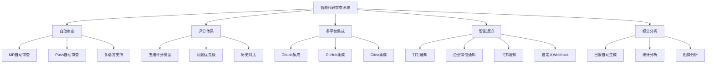
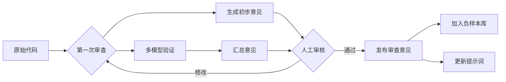
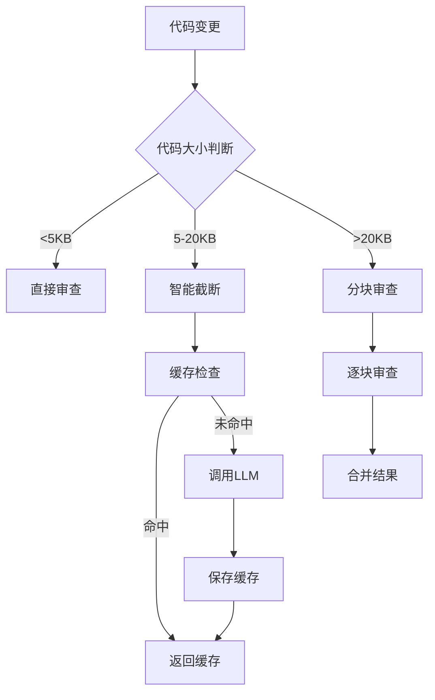
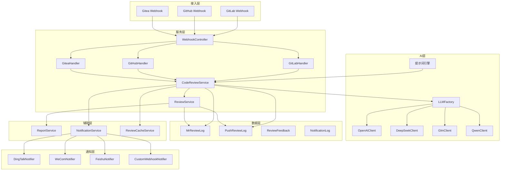

# 《智能代码审查系统》需求设计-第02节：智能代码审查系统目标和挑战

作者：冰河
<br/>星球：[http://m6z.cn/6aeFbs](http://m6z.cn/6aeFbs)
<br/>博客：[https://binghe.site](https://binghe.site)
<br/>文章汇总：[https://binghe.site/md/all/all.html](https://binghe.site/md/all/all.html)
<br/>源码获取地址：[https://t.zsxq.com/UIr1U](https://t.zsxq.com/UIr1U)

> 沉淀，成长，突破，帮助他人，成就自我。

**大家好，我是冰河~~**

> 用 AI 给团队配上 7×24 小时的代码审查员，到底值不值得？

先坦白一件事：我最初对 AI 做代码审查这件事是抗拒的。总觉得代码审查这种东西，得靠人的经验和直觉，机器哪能看懂业务逻辑？但后来团队里资深开发的时间越来越不够用，MR 队列越排越长，新人写的代码小问题反复出现……实在扛不住了，才开始认真琢磨能不能用 AI 搭一套自动审查系统。

折腾了几个月，踩了不少坑，也拿到了实实在在的效果。这次我把这套系统分享给大家，希望对大家有所帮助。

## 一、为什么需要智能代码审查？

先说说痛点，看你是不是也有同感：

- **时间成本**：团队里能看懂复杂代码的人就那么两三个，他们每天光 MR 评论就能耗掉半天
- **深度不足**：大家更关注功能跑没跑通，但边界条件、并发问题、安全漏洞常常被忽略
- **标准不一**：张三觉得缩进用空格没问题，李四非要 Tab，新人不知道该听谁的
- **重复劳动**：同样的低级错误，这个月已经在三个 MR 里指出了三次

我们希望这套系统能做到三件事：

**第一，兜住质量底线**。不依赖人有没有时间、心情好不好，系统会按统一标准扫一遍所有变更。覆盖面、一致性都比人工靠谱。

**第二，缩短反馈周期**。代码刚 push 上去，几秒后就有结果。开发者不用等，改完就能继续往下走。

**第三，顺便带带新人**。审查意见里不光说“这里不对”，还解释为什么、应该怎么写。看得多了，新人的代码质量自然就上来了。

下面是系统主要功能的结构，画得比较直观：



## 二、我们遇到的三个大坑

理想很丰满，落地才发现坑是真的多。挑三个最头疼的说说。

### 坑一：多语言，每个都是祖宗

我们项目里有 Python、JavaScript、Java、Go，还有前端 Vue。每种语言都有自己的“脾气”：

- Python 要 PEP 8、类型提示、docstring
- JS/TS 要关注异步处理、ES6+ 特性、类型安全
- Java 讲究设计模式、异常处理、集合使用
- Go 的 error 处理、并发安全、接口设计完全是另一套

另外，还要支持其他的语言，总体来说，要支持Java、Python、PHP、Yaml、Vue、Go、C、C++、JS、CSS、MD、SQL、TS、TSX、JSX等不同类型的语言.

如果所有语言用同一套提示词，结果就是——什么都没看准。但给每种语言单独维护一套提示词，维护成本又上去了。

**我们的解法**：分层模板 + 继承机制。通用审查标准（功能、安全、性能、规范、可维护性）抽成基础模板，每种语言在这个基础上增加自己的专项要求。新加一门语言的时候，只需要写它特有的那部分提示词，不用重复造轮子。

代码里大概是这样判断语言的：

```java
public String detectLanguageFromDiff(String diffsText) {
    Map<String, Integer> languageCounts = new HashMap<>();
    // 1. 从文件扩展名判断
    // 2. 从代码特征判断（比如看到 def 或者 import 就加一分给 python）
    // 3. 返回得分最高的语言
}
```

### 坑二：只看 diff，看不懂意图

AI 拿到的只是一段增删改的代码片段，没有整个项目的上下文。比如你在 A 文件加了一个函数，在 B 文件调用了它，但 diff 里只看到 B 的变化。AI 可能就会说“这个函数没定义”——其实定义在另一个变更文件里。

还有更麻烦的：这次修改是为了修复一个已知 bug，但 AI 不知道这个背景，可能反过来建议你“不要这么改”。

**我们的解法**：多轮对话 + 上下文增强。第一轮先让 AI 快速扫一遍，发现可疑点之后，主动去 Git 历史里找相关提交、去项目配置里捞业务领域信息，把这些作为额外上下文喂给 AI 做第二轮审查。

另外，评论里我们会附上问题前后各 50 行代码，让开发者一眼就能定位上下文，不用来回翻文件。

### 坑三：评分飘忽不定，谁说了算？

同一段代码，上午审查给 85 分，下午可能就变 75 分。开发者反馈说“你们的 AI 评分是不是随机数？”

确实，代码质量评价本来就有主观成分。但作为工具，评分必须相对稳定、可解释。

**我们的解法**：把评分拆成五个维度，每个维度再拆细项，全部量化。比如“功能正确性”占 40 分，其中逻辑正确性 20 分、边界情况 10 分、异常处理 10 分。扣分必须对应到具体问题，不能凭感觉。

另外，我们把每次审查的评分都记下来，定期跑统计分析。如果发现某个项目历史平均分突然波动很大，就去检查是不是提示词或模型出了问题。这套“历史验证”机制帮我们抓出了好几次模型更新导致的评分偏移。

## 三、我们是怎么应对的

上面三个坑只是冰山一角。运营层面还有准确率、开发者接受度、集成部署一堆事。下面挑几个关键动作讲讲。

### 1. 提高准确率：反馈闭环 + 多模型兜底

准确率是 AI 审查的生命线。误报多了，开发者会直接把机器人拉黑；漏报严重，系统就形同虚设。

**我们做了三件事**：

第一，提示词持续迭代。每次收到开发者的“这个审查不对”反馈，我们会把案例加入负样本库，针对性调整提示词。比如之前 AI 总把 `if (obj != null)` 这种防御性代码误报为“不必要的判空”，我们在提示词里加了一条：**“防御性判空且上下文确实存在空指针风险时，不应扣分”**，误报率降了一大截。

第二，人工审核标记。在后台给每个审查结果加了个“有用/无用”按钮，开发者点一下就能反馈。每周花半小时批量看这些标记，就知道哪里需要优化。

第三，关键 MR 用多模型交叉验证。对于核心模块的变更，我们同时调用 OpenAI、智谱 GLM、通义千问三个模型，把结果汇总后再发布。虽然成本高了点，但核心模块值得。



### 2. 让开发者不讨厌你的机器人

AI 审查很容易招人烦——语气生硬、动不动就扣分、还总说不到点上。我们试了几种风格，发现不同开发者偏好差异巨大：

- 有人喜欢**专业严谨**，像资深架构师那样逐条分析
- 有人喜欢**讽刺幽默**，用🐛💥这种表情包指出问题（反而记得更牢）
- 新人更接受**温和友好**，多给建议、少用“错误”这个词
- 还有人喜欢**轻松有趣**，把技术点评写成段子

所以我们干脆把风格做成可配置的，开发者在个人设置里选自己顺眼的。审查结果里也会带一句“如果你觉得风格不合适，可以点这里切换”。

更重要的是，我们定期给每个开发者生成一份**学习报告**，统计他最近最常见的几类问题，并附上对应的学习资料链接。比如“你这周 SQL 注入问题出现了 3 次，推荐看看 OWASP 的这个页面”。开发者一看，觉得这机器人还真有点用，接受度就上来了。

### 3. 成本：Token 不是大风刮来的

早期我们直接用完整 diff 调用 GPT-4，一个月账单出来差点哭出来。后来做了三波优化：

**智能截断**：不是简单按字符数切，而是优先保留 diff 头（文件路径、行号）、新增/修改的函数签名、关键逻辑部分。注释和空行能省就省。实测 token 消耗减少 40% 左右。

**结果缓存**：大部分 MR 的变更其实很相似（比如反复改同一个配置文件）。我们基于 diff 内容算 MD5，相同的直接返回缓存结果。缓存有效期 24 小时，命中率大概 30%。

**分场景选模型**：简单项目的日常 MR，用便宜的模型（比如 DeepSeek 或通义千问的轻量版）；只有核心模块或可疑的复杂变更，才上 GPT-4 或 GLM-4。成本降了 60% 以上，准确率没怎么掉。



## 四、系统长什么样

说了这么多，还是得把架构贴出来。不复杂，核心就几块：



Webhook 这块我们用了适配器模式，GitLab、GitHub、Gitea 各自一个 Handler，统一接口。以后再加 Coding、Gitee 也很方便。

LLM 客户端也是工厂模式，配置文件里换 provider 就行，代码不用动。

## 五、落地效果和踩坑心得

先说数据。跑了三个月之后：

- 平均审查时间从人工的 15 分钟降到 **8 秒**
- 代码提交覆盖率 **100%**（以前人工只能抽检 30%）
- 安全漏洞类问题检出率比人工高了约 **60%**
- 代码规范类问题（命名、格式、注释）基本绝迹
- 开发团队每周 MR 等待时间减少约 **70%**

当然也有翻车的时候。有一次 AI 把一个很正常的单例模式误判为“并发安全问题”，还给出了一个完全错误的“修复方案”。幸亏有开发者反馈，我们紧急修正了提示词。这种事发生过几次之后，我们养成了一个习惯：**任何自动发布的审查意见，都要留一个“此条有用/无用”的反馈入口**。靠人工标注不断喂数据，系统才会越来越聪明。

另一个教训是：**不要一上来就全量开启**。我们最开始在所有 MR 上都跑 AI 审查，结果第一周被开发者投诉“评论太多，全是废话”。后来改成只在 MR 创建和 push 时触发，而且只针对变更行数超过 10 行或涉及敏感文件的 MR。日常小修改不打扰，大家清净多了。

## 六、未来我们还想做什么

这套系统现在跑得还算稳，但我们心里清楚，离“理想状态”还很远。接下来几个方向：

**短期（3-6 个月）**：增加 Rust、Kotlin 等更多语言支持；尝试接入本地小模型（比如 CodeLlama 微调版），进一步降低成本；实现“一键修复”——AI 指出问题后直接生成 patch，开发者点一下就能应用。

**中期（6-12 个月）**：做代码质量趋势分析，每个项目生成健康度曲线；跟 SonarQube、ESLint 这类静态工具打通，互相补充。

**长期（1-2 年）**：打造一个代码质量中台，不光是审查，还能根据代码变更自动推荐测试用例、自动更新相关文档。理想情况下，开发者只需要专注业务逻辑，其他杂活都交给 AI。

## 七、最后说两句

说实话，做智能代码审查这件事，技术难度不算特别高，但工程落地真的很磨人。要平衡准确率和成本，要照顾开发者的情绪，要跟现有的 CI/CD 流程丝滑集成……每一个环节都能让你踩坑。

但如果让我重新选择，我还是会做。因为它解决的是一个真实存在的痛点——**代码审查不是不重要，而是传统方式真的做不到了**。项目越大、团队越大，人工审查就越力不从心。AI 不是来替代人的，是来给每个人配一个不知疲倦的副驾驶。

如果你也在考虑给团队上类似系统，我的建议是：**从小范围、低成本的 MVP 开始，跑通流程、拿到反馈，再逐步迭代。** 别想着一步到位，那只会让你被一堆坑埋掉。

## 写在最后

在冰河技术知识星球， **《AI智能代码审查平台》、《AI全链路短剧生成平台》** 已完结，同时，**《企业级微服务开放平台》** 项目热更中，还有其他二十几个项目，像实战Claude Code、AI知识库系统、智流助手平台、智能成语挑战赛项目、多轮AI智能对话系统、一站式AI智能平台、AI智能客服系统、AI智能问答系统、实战AI大模型、手写高性能敏组件、手写线程池、手写高性能SQL引擎、手写高性能Polaris网关、手写高性能熔断组件、手写通用指标上报组件、手写高性能数据库路由组件、手写分布式IM即时通讯系统、手写Seckill分布式秒杀系统、手写高性能RPC、实战高并发设计模式、简易商城系统等等。

这些项目的需求、方案、架构、落地等均来自互联网真实业务场景，让你真正学到互联网大厂的业务与技术落地方案，并将其有效转化为自己的知识储备。

**值得一提的是：冰河自研的Polaris高性能网关比某些开源网关项目性能更高，目前正在热更AI一体化项目，也正在实现MCP，全程带你分析原理和手撸代码。**

你还在等啥？不少小伙伴经过星球硬核技术和项目的历练，早已成功跳槽加薪，实现薪资翻倍，而你，还在原地踏步，抱怨大环境不好。抛弃焦虑和抱怨，我们一起塌下心来沉淀硬核技术和项目，让自己的薪资更上一层楼。

🚀PS：**目前已开通最大优惠：长按或扫码加入星球立减30，注意：随着项目和专栏的更新，星球也即将涨价！！**

<div align="center">
    
    <div style="font-size: 18px;"></div>
    <br/>
</div>

目前，领券加入星球就可以跟冰河一起学习《实战Claude Code》、《多轮AI智能对话系统》、《一站式AI智能平台》、《AI智能客服系统》、《AI智能问答系统》、《实战AI大模型》、《手写高性能Redis组件》、《手写高性能脱敏组件》、《手写线程池》、《手写高性能SQL引擎》、《手写高性能Polaris网关》、《手写高性能RPC项目》、《分布式Seckill秒杀系统》、《分布式IM即时通讯系统》《手写高性能通用熔断组件项目》、《手写高性能通用监控指标上报组件》、《手写高性能数据库路由组件》、《手写简易商城脚手架项目》、《Spring6核心技术与源码解析》和《实战高并发设计模式》，从零开始介绍原理、设计架构、手撸代码。

**花很少的钱就能学这么多硬核技术、中间件项目和大厂秒杀系统、分布式IM即时通讯系统，AI大模型项目，比其他培训机构不知便宜多少倍，硬核多少倍，如果是我，我会买他个十年！**

加入要趁早，后续还会随着项目和加入的人数涨价，而且只会涨，不会降，先加入的小伙伴就是赚到。

另外，还有一个限时福利，邀请一个小伙伴加入，冰河就会给一笔 **分享有奖** ，有些小伙伴都邀请了50+人，早就回本了！

## 其他方式加入星球

- **链接** ：打开链接 http://m6z.cn/6aeFbs 加入星球。
- **回复** ：在公众号 **冰河技术** 回复 **星球** 领取优惠券加入星球。

**特别提醒：** 苹果用户进圈或续费，请加微信 **hacker_binghe** 扫二维码，或者去公众号 **冰河技术** 回复 **星球** 扫二维码加入星球。

**好了，今天就到这儿吧，我是冰河，我们下期见~~**