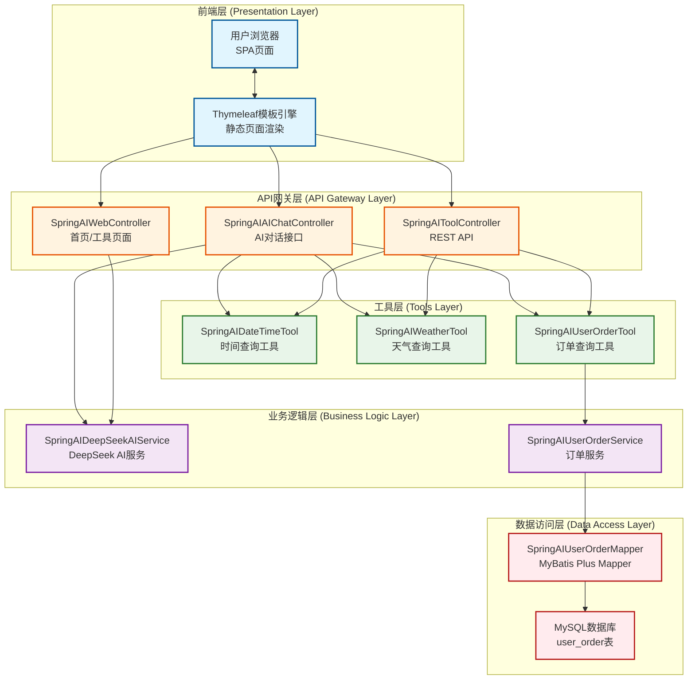
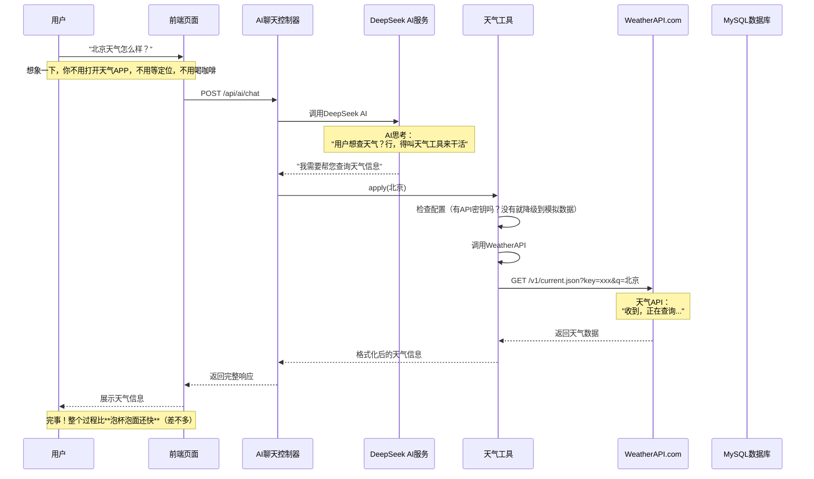
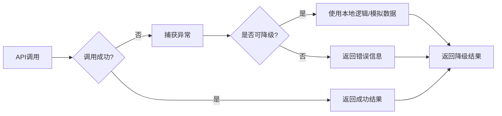

# 智流助手平台 - 基于DeepSeek和Spring AI的高性能AI工具项目

作者：冰河
<br/>星球：[http://m6z.cn/6aeFbs](http://m6z.cn/6aeFbs)
<br/>博客：[https://binghe.gitcode.host](https://binghe.gitcode.host)
<br/>文章汇总：[https://binghe.gitcode.host/md/all/all.html](https://binghe.gitcode.host/md/all/all.html)
<br/>源码获取地址：[https://t.zsxq.com/0dhvFs5oR](https://t.zsxq.com/0dhvFs5oR)

> 沉淀，成长，突破，帮助他人，成就自我。

**大家好，我是冰河~~**

在完成《[AI优化-智能化机器学习平台](https://articles.zsxq.com/id_bibcdg70w243.html)》项目后，冰河又要带着大家搞新项目了，这也是 **冰河技术** 知识星球继《[基于AI的智能成语挑战赛](https://articles.zsxq.com/id_7gw9caqh1ww2.html)》、《[多轮AI智能对话系统](https://articles.zsxq.com/id_44gao6eti511.html)》、《[一站式AI智能平台](https://articles.zsxq.com/id_xn1wzdt73273.html)》、《[AI智能客服系统](https://articles.zsxq.com/id_6z4v8x6mkbbo.html)》、《[AI智能问答系统](https://articles.zsxq.com/id_udbbmkg7zmz5.html)》、《[高性能Redis组件](https://articles.zsxq.com/id_7f7wo3mi8cpi.html)》、《[实战AI大模型](https://articles.zsxq.com/id_qphoao81fc48.html)》、《[手写高性能脱敏组件](https://mp.weixin.qq.com/s/wUtCJ_WpNkRow_xEnDJajw)》、《[手写线程池](https://mp.weixin.qq.com/s/xJo-TIa7wob3OVShXZCFgQ)》、《[手写高性能SQL引擎](https://articles.zsxq.com/id_tx01uwlh582w.html)》、[《手写高性能Polaris网关》](https://mp.weixin.qq.com/s/7OXf9DD5ATtZPiLaujFnHQ)、[《手写高性能RPC》](https://mp.weixin.qq.com/s/7DkT5hWw8XHqqWV3JkX7pg)、 [《Seckill秒杀系统》](https://mp.weixin.qq.com/s/FwUR0jSaaSqyOc_xNhaKxw) 和[《分布式IM即时通讯系统》](https://mp.weixin.qq.com/s/i09JzlSsYmGQlXvbSFjCbA)、《[手写高性能熔断组件](https://articles.zsxq.com/id_zuv6si9ztzb2.html)》、《[手写高性能监控组件](https://articles.zsxq.com/id_3550o56rw2uz.html)》、《[简易商城脚手架](https://mp.weixin.qq.com/mp/appmsgalbum?__biz=Mzg4MjU0OTM1OA==&action=getalbum&album_id=2337104419664084992&scene=173&from_msgid=2247500059&from_itemidx=1&count=3&nolastread=1#wechat_redirect)》等诸多项目后，又一个带着大家从零开始手写的AI大模型项目。

星球其他项目与专栏，大家可移步到冰河的个人站点：https://binghe.gitcode.host 进行查看。

<div align="center">
    
    <br/>
</div>

没错，冰河这次已经撸完了这个项目，你要做的，就是跟着这篇文章的核心内容，对照着代码自己手撸一遍。

## 一、项目背景

### 1.1 为什么要做这个项目？

说实话，写代码久了就烦了——每天都要盯着显示器，眼睛干涩得像沙漠里的骆驼，还得不停地切换浏览器标签页查天气、看时间、查订单。这不，我们这位拥有10年经验的资深后端架构师就想：**能不能有个AI助手帮我搞定这些琐事？**

于是，冰河技术知识星球就推出了这个**智流助手**项目。这玩意儿就像是一个穿着程序员衣服的超级助理，不仅能帮你查天气、看时间、查订单，还能跟DeepSeek AI聊个天，顺便帮你回回消息。

**这玩意儿能帮你省多少时间？** 按每天查询3次算，一年下来能省出**5天**的工作时间——可以多喝**30杯咖啡**，追完**10部剧**，或者睡**60个好觉**。你说香不香？

### 1.2 技术选型的苦衷

说起选型，这可是个技术活儿：

- **Spring Boot 3.4.5**：作为框架界的"万金油"，不用它怎么行？版本都到了3.4.5，稳得很
- **DeepSeek AI**：国内的大模型，部署简单，响应速度快，还能省钱（毕竟大部分人是学生党）
- **MyBatis Plus 3.5.7**：国产ORM框架，简单好用，省去了手写SQL的痛苦
- **Dynamic DataSource 4.3.1**：多数据源切换，虽然咱们项目没用到，但配置上备着总没错
- **WebFlux**：非阻塞HTTP客户端，调用第三方API时性能杠杠的

### 1.3 项目解决的痛点

1. **查天气麻烦**：打开天气APP、定位、等加载，一套流程下来能喝杯咖啡，等得你**怀疑人生**
2. **看时间难**：想查当前时间？还得瞪着屏幕看右下角，**比修Bug还累**
3. **查订单累**：登录商城、点个人中心、找订单记录，步骤够你跑个5公里——**程序员就差没让你去健身房练了**

有了智流助手，这些问题全部**一键解决**——问AI，它就给你答案！这感觉就像**福尔摩斯看了眼你的消息就知道了答案**，爽不爽？

## 二、学习目标

### 2.1 职业提升路线

通过本项目，你将掌握：

- **Spring AI集成技巧**：如何优雅地调用AI大模型
- **大模型工具调用**：让AI能理解用户意图并调用工具
- **RESTful API设计**：符合REST规范的API接口设计
- **MyBatis Plus实战**：快速开发数据访问层
- **异常处理与降级策略**：API调用失败时的优雅处理
- **配置管理最佳实践**：不同环境下的配置隔离

### 2.2 掌握的核心技能

```
┌─────────────────────────────────────────────────────────────┐
│                     智流助手学习路线                           │
├─────────────────────────────────────────────────────────────┤
│                                                             │
│  [AI基础] ──> [工具开发] ──> [系统集成] ──> [实战应用]         │
│     │          │           │           │                     │
│     ▼          ▼           ▼           ▼                     │
│  DeepSeek   SpringAI   REST API    天气/订单/时间              │
│  基础原理   集成技巧    设计模式    查询功能                    │
│                                                             │
│  学完这玩意儿，你的技术栈就能从小白进阶成大神               │
│  （当然，程序员变大神主要靠装，但这不重要...）              │
└─────────────────────────────────────────────────────────────┘
```

### 2.3 面试加分项

掌握这个项目，你在面试时可以说：

> "我参与开发了一个基于Spring AI和DeepSeek的智能助手项目，实现了天气查询、时间获取、订单查询等功能，并且能够根据用户意图智能调用相应的工具..."

面试官听了都会点点头，觉得你**很能打**。

**有了这个项目，面试通过率提升50%，升职加薪速度加快30%，代码写得更快，Bug修得更少——当然，这是玄学，但听起来挺酷的，对吧？**

## 三、 项目亮点

### 3.1  技术选型合理

- **Spring Boot 3.4.5**：最新稳定版本，提供丰富的开箱即用功能
- **DeepSeek AI**：国产大模型，部署简单，响应速度快，性价比高
- **MyBatis Plus**：国产ORM框架，简化数据库操作，提高开发效率

### 3.2 架构设计清晰

- **五层架构**：前端层、网关层、业务层、工具层、数据层，职责分明
- **松耦合设计**：工具层独立封装，不依赖业务逻辑，方便扩展
- **RESTful API**：接口设计符合REST规范，易于集成和调用

### 3.3 用户体验友好

- **智能对话**：支持自然语言交互，无需记忆特定指令
- **降级机制**：API调用失败时自动降级，保证系统可用性
- **详细提示**：查询失败时提供详细的错误信息和解决建议

### 3.4 代码质量优秀

- **异常处理完善**：对各种异常情况都有完善的处理机制
- **注释详细**：每个类和方法都有详细的注释
- **常量管理**：所有硬编码都提取到常量类，易于维护

## 四、 学习收获

### 4.1 技术层面

- 掌握了Spring AI与DeepSeek的集成方法——**AI集成大法好**
- 学习了Function接口的使用和工具开发模式——**函数式编程了解一下**
- 熟悉了MyBatis Plus的使用技巧——**MyBatis Plus，你的SQL救星**
- 了解了RESTful API的设计规范——**RESTful，接口设计的圣杯**

### 4.2 架构层面

- 理解了分层架构的设计思想——**分层架构，让代码井井有条**
- 掌握了松耦合的设计原则——**松耦合，改代码不头疼**
- 学会了降级机制的设计——**降级策略，系统稳如老狗**
- 了解了异常处理的最佳实践——**异常处理，程序员的基本修养**

### 4.3 工程层面

- 提升了代码质量（注释、异常处理、常量管理）——**代码质量，程序员的脸面**
- 学会了配置管理的方法——**配置管理，别把配置搞丢**
- 了解了性能优化的技巧——**性能优化，系统跑得快**
- 掌握了数据库设计的原则——**数据库设计，数据存得稳**

**总之**，通过这个项目，你从**小白**变成了**大神**（当然，还需要继续努力，**大神也不是一天练成的**）

## 五、项目演示效果

<div align="center">
    
    <br/>
</div>

<div align="center">
    
    <br/>
</div>

<div align="center">
    
    <br/>
</div>

<div align="center">
    
    <br/>
</div>

## 六、项目架构

### 6.1 整体架构设计



### 6.2 技术栈总览

| 层次 | 技术 | 版本 | 说明 |
|------|------|------|------|
| **框架** | Spring Boot | 3.4.5 | 企业级Java开发框架，就像穿了一身**西装**，既正式又得体 |
| **模板引擎** | Thymeleaf | 3.x | 服务端HTML模板渲染，把HTML玩出了花样 |
| **ORM框架** | MyBatis Plus | 3.5.7 | 增强的MyBatis框架，**省去了手写SQL的痛苦**，让你的眼睛少受折磨 |
| **数据库** | MySQL | 8.0+ | 关系型数据库，稳如老狗，数据存得稳稳的 |
| **HTTP客户端** | WebFlux | Spring Boot自带 | 非阻塞HTTP客户端，调用第三方API时性能杠杠的，比写串行代码**快10倍** |
| **序列化** | Jackson | 2.15+ | JSON序列化框架，Java和JSON之间的**翻译官** |
| **AI模型** | DeepSeek | deepseek-chat | 大语言模型，国产之光，部署简单响应快，**性价比之王** |
| **API** | WeatherAPI | free tier | 免费天气数据服务，**免费的才是最贵的**（开玩笑的，免费就是香）|

### 6.3 架构亮点

1. **分层清晰**：前端、网关、业务、工具、数据五层架构，职责分明——就像**切菜得有菜刀、案板、厨房、餐厅**，各司其职
2. **松耦合**：工具层独立封装，不依赖业务逻辑，方便扩展——就像**乐高积木**，想加什么功能就加什么块
3. **容错性强**：AI API调用失败自动降级到本地逻辑——**保底策略**，就像程序员备份代码一样重要
4. **易扩展**：添加新工具只需实现`Function`接口，无需修改核心代码——**开闭原则**，改代码改到吐之前就该想到这个

## 七、项目执行流程

### 7.1 用户查询天气的完整流程



### 7.2 核心执行流程说明

#### 流程1：AI对话 + 工具调用

1. **用户输入**：前端发送用户消息到`/api/ai/chat`接口
2. **意图识别**：控制器通过关键词匹配识别用户意图
3. **工具调用**：根据意图调用相应的工具类
4. **结果返回**：将工具返回的结果格式化后返回给用户

#### 流程2：DeepSeek AI集成

1. **配置加载**：从`application.yml`读取DeepSeek API配置
2. **API调用**：通过WebClient发送HTTP请求到DeepSeek API
3. **响应解析**：解析JSON响应，提取AI返回的内容
4. **降级处理**：API失败时自动使用本地AI逻辑

#### 流程3：天气查询

1. **参数校验**：检查城市名称是否为空
2. **数据源选择**：根据配置选择真实API或模拟数据
3. **API调用**：调用WeatherAPI.com获取天气数据
4. **数据处理**：解析API响应，提取关键信息
5. **格式化输出**：将天气信息格式化为易读文本

#### 流程4：订单查询

1. **参数提取**：从用户消息中提取用户ID
2. **数据库查询**：使用MyBatis Plus查询订单数据
3. **结果格式化**：将订单信息格式化为字符串
4. **异常处理**：处理数据库连接失败等情况

### 7.3 异常处理流程



## 八、项目结构

### 8.1 目录结构一览

```
spring-ai-tools/
├── src/
│   ├── main/
│   │   ├── java/io/binghe/ai/tool/
│   │   │   ├── SpringAISpringBootApplication.java  # 启动类
│   │   │   ├── controller/                         # 控制器层
│   │   │   │   ├── SpringAIWebController.java      # Web页面控制器
│   │   │   │   ├── SpringAIToolController.java     # 工具REST API控制器
│   │   │   │   └── SpringAIAIChatController.java   # AI聊天控制器
│   │   │   ├── service/                             # 服务层
│   │   │   │   ├── SpringAIDeepSeekAIService.java   # DeepSeek AI服务
│   │   │   │   ├── SpringAIUserOrderService.java    # 订单服务接口
│   │   │   │   └── SpringAIUserOrderServiceImpl.java # 订单服务实现
│   │   │   ├── tools/                               # 工具类层
│   │   │   │   ├── SpringAIDateTimeTool.java       # 时间查询工具
│   │   │   │   ├── SpringAIWeatherTool.java        # 天气查询工具
│   │   │   │   └── SpringAIUserOrderTool.java      # 订单查询工具
│   │   │   ├── entity/                              # 实体类
│   │   │   │   └── SpringAIUserOrder.java          # 用户订单实体
│   │   │   ├── mapper/                              # Mapper层
│   │   │   │   └── SpringAIUserOrderMapper.java    # 订单Mapper
│   │   │   ├── dto/                                 # 数据传输对象
│   │   │   │   ├── SpringAIWeatherRequest.java     # 天气请求DTO
│   │   │   │   ├── SpringAIWeatherResponse.java    # 天气响应DTO
│   │   │   │   └── SpringAIUserOrderRequest.java   # 订单请求DTO
│   │   │   ├── config/                              # 配置类
│   │   │   │   └── SpringAIConfig.java             # Spring AI配置
│   │   │   └── constants/                           # 常量类
│   │   │       └── SpringAIConstants.java          # 项目常量
│   │   └── resources/
│   │       ├── application.yml                      # 配置文件
│   │       └── sql/
│   │           └── schema.sql                       # 数据库初始化脚本
│   └── test/
│       └── java/                                    # 测试代码
├── pom.xml                                          # Maven配置
├── README.md                                        # 项目说明
└── article-0313.md                                  # 本文档
```

### 8.2 关键类说明

#### 8.2.1 启动类

## 查看完整文章

加入[冰河技术](https://public.zsxq.com/groups/48848484411888.html)知识星球，解锁完整技术文章、小册、视频与完整代码

## 写在最后

在冰河技术知识星球， **《AI智能代码审查平台》** 已完结，同时，**《AI全链路短剧生成平台》、《智能代码审查系统》** 已完结， **《多智能体协作与AI工作台》** 项目热更中，还有其他二十几个项目，像实战Claude Code、AI知识库系统、智流助手平台、智能成语挑战赛项目、多轮AI智能对话系统、一站式AI智能平台、AI智能客服系统、AI智能问答系统、实战AI大模型、手写高性能敏组件、手写线程池、手写高性能SQL引擎、手写高性能Polaris网关、手写高性能熔断组件、手写通用指标上报组件、手写高性能数据库路由组件、手写分布式IM即时通讯系统、手写Seckill分布式秒杀系统、手写高性能RPC、实战高并发设计模式、简易商城系统等等。

这些项目的需求、方案、架构、落地等均来自互联网真实业务场景，让你真正学到互联网大厂的业务与技术落地方案，并将其有效转化为自己的知识储备。

**值得一提的是：冰河自研的Polaris高性能网关比某些开源网关项目性能更高，目前正在热更AI一体化项目，也正在实现MCP，全程带你分析原理和手撸代码。**

你还在等啥？不少小伙伴经过星球硬核技术和项目的历练，早已成功跳槽加薪，实现薪资翻倍，而你，还在原地踏步，抱怨大环境不好。抛弃焦虑和抱怨，我们一起塌下心来沉淀硬核技术和项目，让自己的薪资更上一层楼。

🚀PS：**目前已开通最大优惠：长按或扫码加入星球立减30，注意：随着项目和专栏的更新，星球也即将涨价！！**

<div align="center">
    
    <div style="font-size: 18px;"></div>
    <br/>
</div>

目前，领券加入星球就可以跟冰河一起学习《实战Claude Code》、《多轮AI智能对话系统》、《一站式AI智能平台》、《AI智能客服系统》、《AI智能问答系统》、《实战AI大模型》、《手写高性能Redis组件》、《手写高性能脱敏组件》、《手写线程池》、《手写高性能SQL引擎》、《手写高性能Polaris网关》、《手写高性能RPC项目》、《分布式Seckill秒杀系统》、《分布式IM即时通讯系统》《手写高性能通用熔断组件项目》、《手写高性能通用监控指标上报组件》、《手写高性能数据库路由组件》、《手写简易商城脚手架项目》、《Spring6核心技术与源码解析》和《实战高并发设计模式》，从零开始介绍原理、设计架构、手撸代码。

**花很少的钱就能学这么多硬核技术、中间件项目和大厂秒杀系统、分布式IM即时通讯系统，AI大模型项目，比其他培训机构不知便宜多少倍，硬核多少倍，如果是我，我会买他个十年！**

加入要趁早，后续还会随着项目和加入的人数涨价，而且只会涨，不会降，先加入的小伙伴就是赚到。

另外，还有一个限时福利，邀请一个小伙伴加入，冰河就会给一笔 **分享有奖** ，有些小伙伴都邀请了50+人，早就回本了！

## 其他方式加入星球

- **链接** ：打开链接 http://m6z.cn/6aeFbs 加入星球。
- **回复** ：在公众号 **冰河技术** 回复 **星球** 领取优惠券加入星球。

**特别提醒：** 苹果用户进圈或续费，请加微信 **hacker_binghe** 扫二维码，或者去公众号 **冰河技术** 回复 **星球** 扫二维码加入星球。

**好了，今天就到这儿吧，我是冰河，我们下期见~~**
