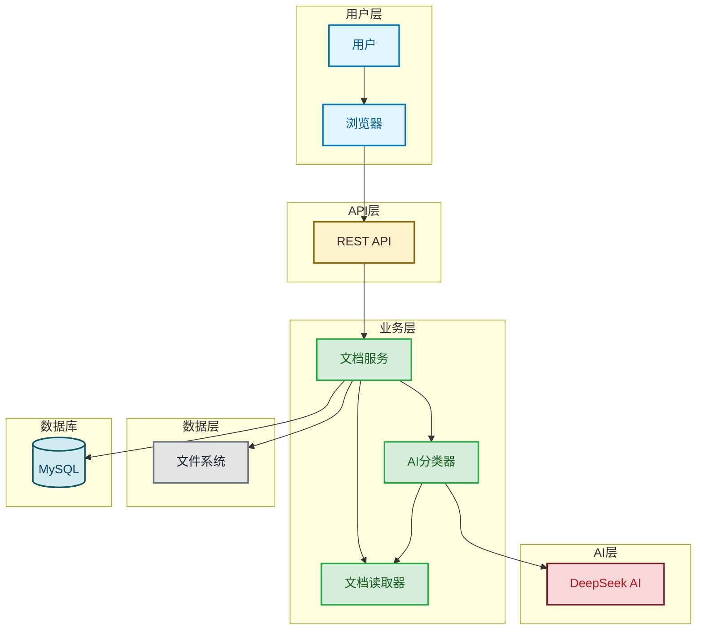
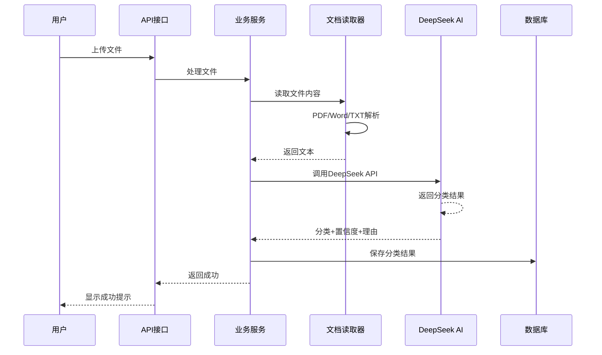

# 《智能知识库系统》总结：Spring AI + DeepSeek 智能知识库系统完结上线

**大家好，我是冰河~~**

说真的，你有没有经历过这样的场景：

想象一下，你在一个知识管理平台上传了1000份技术文档，包括Spring源码分析、Redis性能优化、分布式系统设计、微服务架构实践...然后某个周末的下午，你突然需要找一份关于"Spring AI配置"的文档，准备给团队做个分享。

这时候，你面对的就是一座文档大山。你打开搜索框，输入"Spring AI"，然后开始在大海捞针：这份文档是讲Spring AI框架的？不是，这是讲Spring Boot启动原理的；那份也不是，这是讲Spring Security认证的...

你翻遍了1000份文档，最后发现那份Spring AI文档就躺在倒数第3页，而且当时上传的时候你可能只是随手起了个名字叫"AI相关.doc"，根本没想清楚要放哪儿。

这种经历，相信每个做过技术知识管理的朋友都深有体会。这就像你的电脑桌面上堆满了各种文件，什么"新建文档1"、"重要文件(1)"、"[未命名]"...你根本不知道哪个文件里到底存了什么，直到有一天你需要紧急找它的时候，才欲哭无泪。

所以，我们决定干件大事——给文档装上一个AI大脑。

## 1. 项目背景：为什么需要智能分类？

### 1.1 痛点直击：当文档变成"信息垃圾场"

在传统的文档管理世界里，我们面临着几个让人头秃的问题：

**痛点一：手动分类太累了**

还记得你第一次上传文档时的场景吗？你坐在电脑前，打开文件管理器，新建一个文件夹叫"技术文档"，然后把你刚写的技术文章扔进去。接着又想，不对，这篇文章是关于Redis的，是不是应该单独建个"数据库"文件夹？然后再想想，这个分类会不会太细了，会不会影响以后的整理？

就这样，你手忙脚乱地新建文件夹、移动文件、整理目录，最后累得腰酸背痛，结果一看，文档还是乱七八糟。等你忙完这一下午，你的电脑上多了十几个文件夹，每个文件夹里又混着各种文档，分类标准前后不一。

再过一个月，你再看这些文件夹，你会觉得自己在浪费时间。因为分类系统不是为了分类而分类，而是为了让你以后能快速找到东西。

**痛点二：找文档难，难于上青天**

最痛苦的时刻是什么？是当你需要在客户面前演示一个功能，却发现找不到某个关键的技术文档的时候。你打开搜索框，输入关键词，翻了几页，一无所获。你开始怀疑自己：我明明上传过这个文档啊？是不是被我删了？还是文件名起错了？

这时候，你才发现一个文档管理系统最重要的功能不是分类，而是搜索。但如果你连文档存哪儿了都不知道，搜索又有什么用呢？

**痛点三：标准不一，混乱不堪**

团队的每个人对文档的分类标准都不一样。有的人喜欢按技术领域分类，有的人喜欢按文件类型分类，还有的人单纯按心情分类。结果就是，A同事把技术文档放在了"技术分享"文件夹，B同事把它移到了"参考资料"文件夹，C同事又觉得它应该在"算法与数据结构"里...

三个月后，整个文档系统变成了一锅粥。你说找文档难不难？

**痛点四：多格式支持差，头痛加倍**

你以为上传PDF就完事了？错了。PDF还好说，至少有个文本提取工具能把内容读出来。但你上传个Word文档试试，Apache POI虽然强大，但处理复杂的Word文档还是经常报错。

更别提你有时候还想上传个TXT文本文件、个Markdown文档、个HTML文档...每种格式都要写不同的读取逻辑，维护起来简直是噩梦。

**痛点五：内容不透明，盲人摸象**

传统文档管理的最大问题不是文件分得乱，而是你根本不知道某个文件里到底讲了什么。你说这个文件叫"Spring性能优化"，但点进去一看，里面全是Redis的缓存策略，完全跟Spring没关系。

这就是所谓的"盲人摸象"。你只看得到文件名，却摸不到里面的内容。在AI时代，这简直不可原谅。

### 1.2 解决方案：给文档装个AI大脑

所以，我们决定干件大事——给文档装上一个AI大脑。

什么意思呢？简单说就是：

当你上传一份文档的时候，AI不是简单地把它存到某个默认文件夹，而是会：

**第一步：读懂文档内容**

AI会仔细阅读你上传的文档，理解里面到底讲了什么。不是简单地把文字复制粘贴，而是真正理解文档的意图、主题、重点。比如，看到"Spring AI + DeepSeek集成"，AI就知道这事儿跟AI应用开发有关；看到"Redis缓存失效问题排查"，就知道这事儿跟缓存优化有关。

**第二步：智能判断分类**

基于对内容的理解，AI会告诉你这份文档应该归到哪个分类。而且它还会告诉你"我有多确定"。比如AI可能会说："我觉得这是'技术文档'，置信度95%"。那个95%的置信度就像AI在跟你交心："兄弟，我对这个判断很有信心啊！"

**第三步：给出分类理由**

AI不会光说结论，还会说理由。比如它会解释："因为我看到了Spring AI、DeepSeek、ChatClient这些关键词，这些通常出现在AI应用开发的技术文档中，所以我觉得应该是'技术文档'。"这样你就可以判断AI的判断是否准确，如果不准确，你还可以人工修正。

**第四步：顺便帮你管理**

除了分类，AI还会帮你做些其他事情。比如统计你的文档库现在是什么状态：总共有多少文档，哪些分类最常见，最近一周上传了多少文档，AI分类的平均置信度是多少...

这些数据能帮你更好地了解你的知识库。

**第五步：快速检索**

有了AI的理解，搜索就变得简单了。你不需要记文件名，而是可以直接搜索内容。比如你搜索"Spring AI配置教程"，系统会直接给你找到所有包含这个内容的文档，不管文件名叫什么。

## 2. 技术架构：简单就是美

### 2.1 整体架构图

这个项目的架构设计，我们遵循了一个原则：简单就是美。

你可能会问，AI应用这么复杂，架构能简单吗？确实，AI应用涉及很多技术栈，但架构的复杂性不等于代码的复杂性。我们的架构设计注重层次清晰、职责明确、易于理解和扩展。

先来看一下整体架构图：



看这个架构图，是不是很清晰？就像我们画的各种分层架构图一样，每一层都有明确的职责，每一层都专注于自己该做的事情。

#### 用户层：你就是主角

用户层很简单，就是你和浏览器。你坐在电脑前，打开浏览器，访问这个系统。你的角色很明确：上传文件、查看文档、搜索内容、查看统计数据...你就是这个系统的用户，所有功能都是为你服务的。

#### API层：前后端的桥梁

API层是前后端的桥梁。前端通过HTTP请求调用API，API层负责接收请求、处理业务逻辑、返回响应。整个系统采用RESTful API设计风格，这就是为什么你会看到很多像`/api/v1/documents/upload`这样的接口路径。

#### 业务层：系统的核心

业务层是整个系统的大脑。这里有一堆服务类，每个服务类都有自己的专长：

**文档服务（DocumentService）**：负责文档的CRUD操作。你上传文件、下载文件、删除文件、搜索文档，这些事情都是它在管。

**AI分类器（Classifier）**：负责调用DeepSeek AI进行文档分类。这是系统的核心竞争力，也是最能体现AI价值的地方。

**文档读取器（Reader）**：负责读取各种格式的文档内容。PDF、Word、TXT...你想上传什么格式，它就能读什么格式。

**统计分析服务（StatisticsService）**：负责统计你的文档库数据。总文档数、分类分布、上传趋势...你想看什么数据，它都能给你。

#### 数据层：数据的安全港湾

数据层由两部分组成：

**文件系统**：你的文档文件存放在这里。每当你上传文件，系统会把它保存到`./uploads/`目录下。文件名用UUID生成，避免重复。文件大小、文件类型、上传时间等信息都会记录下来。

**数据库**：你的文档元数据、分类结果、统计数据都存在这里。我们用的是MySQL数据库，用JPA/Hibernate作为ORM框架。好处是代码不用写SQL，框架自动帮你生成和执行。

#### AI层：DeepSeek大模型

这一层只有DeepSeek AI。这是我们选择的AI大模型，国产的、中文理解能力强、性价比高。整个系统的智能核心就集中在这里。

### 2.2 核心技术栈：每一样工具都有它的用武之地

这个项目用到的技术栈有点多，但每一项都是经过深思熟虑的：

| 层级 | 技术 | 用途 | 为什么选它 |
|------|------|------|------------|
| **后端框架** | Spring Boot 3.2.0 | 应用框架 | 最流行的Java框架，生态完善，自动配置强大 |
| **AI框架** | Spring AI 1.0.0 | AI模型调用 | 提供统一的AI模型接口，方便切换不同的AI模型 |
| **大模型** | DeepSeek Chat | 智能分类引擎 | 国产大模型，中文理解优秀，性价比高 |
| **数据存储** | MySQL 8.0 | 持久化存储 | 成熟稳定的关系型数据库，适合存储结构化数据 |
| **ORM** | Spring Data JPA | 数据库操作 | 声明式数据访问，不用写SQL |
| **文件处理** | PDFBox / POI / Tika | 多格式文档解析 | PDFBox处理PDF，POI处理Word，Tika统一解析 |
| **前端模板** | Thymeleaf | 服务端渲染 | 简单易用，可以直接在HTML里写Java表达式 |
| **UI框架** | Tailwind CSS | 美观界面 | 实用优先的CSS框架，不需要写一大堆CSS代码 |
| **图表库** | Chart.js | 数据可视化 | 画统计图表的神器，几行代码就能出图 |

你可能问：为什么用这么多工具？不能用一个框架搞定所有事情吗？

因为这是现实世界的问题，不是toy problem。你要处理多种文件格式，要画漂亮的图表，要存数据，这些都是真实的需求。我们选择每个技术，都是因为它在某个特定场景下是最合适的。

而且，Spring Boot+Spring AI+DeepSeek的组合，已经能支撑起一个完整的AI应用了。再加其他技术，就有点过度设计了。

---

## 3. 核心功能：AI如何分类文档？

### 3.1 工作流程：看AI是怎么工作的

当你上传一份文档时，系统是怎么处理的？让我用一张时序图给你展示整个流程：



看这个时序图，从用户上传文件到系统返回结果，经历了这么几个步骤：

1. **用户上传**：你在浏览器里选择一个文件，点击"上传"按钮。文件通过HTTP POST请求上传到服务器。

2. **文件验证**：系统收到文件后，先验证文件的大小和类型。文件太大？超过50MB了？系统会告诉你"文件太大"。文件格式不支持？系统会告诉你"不支持这个格式"。

3. **文件保存**：验证通过后，系统会把文件保存到服务器的`./uploads/`目录。文件名用UUID生成，比如`a1b2c3d4-e5f6-7890-1234-5678abcdef12.pdf`。这样就不会有重名问题了。

4. **创建记录**：文件保存后，系统会创建一条数据库记录，记录文件的基本信息：原始文件名、保存的文件名、文件路径、文件大小、文件类型、上传时间。这时候，文档状态是"待分类"。

5. **异步处理**：关键来了！上传完成后，系统会立即返回成功响应给用户。你看到"上传成功"的提示，以为任务已经完成了。但实际上，真正的处理还在后台进行。

6. **提取文本**：系统会异步读取刚才上传的文件内容。如果是PDF，用PDFBox解析；如果是Word，用POI解析；如果是TXT，直接读取。这个过程可能需要几秒钟。

7. **AI分类**：拿到文件内容后，系统会调用DeepSeek AI进行分类。这是核心步骤，AI会仔细分析文档内容，判断应该属于哪个分类。

8. **保存分类结果**：AI返回分类结果后，系统会把分类信息保存到数据库。这时候，文档状态就变成了"已分类"。

整个过程你一开始就能看到结果，而文本提取和AI分类在后台进行，不会影响你的用户体验。

### 3.2 分类提示词设计：如何让AI听得懂你的需求

AI为什么会分类？因为它能理解你的分类要求。而这个理解来自于提示词。

提示词就是你给AI的指令，告诉AI应该怎么做。我们的提示词是这样的：

```markdown
请对以下文件内容进行分类，从以下类别中选择最合适的一个：

1. 技术文档 - 技术规范、API文档、开发指南等
2. 商业文档 - 商业计划、市场分析、财务报告等
3. 法律文档 - 合同、协议、法律条文等
4. 学术文档 - 研究论文、学术报告、教育材料等
5. 新闻资讯 - 新闻报道、资讯文章等
6. 其他文档 - 不属于以上类别的文档

请仔细分析文件内容，并按照以下格式返回结果：
分类：[类别名称]
置信度：[0.0-1.0之间的数值]
理由：[简要说明分类理由]

文件内容：
[这里填入文档的实际内容]
```

这个提示词包含几个关键部分：

**第一部分：分类列表**

告诉你AI可以从哪些分类中选择。这很重要，AI不能随便分类，必须在给定的分类列表里选择。而且每个分类都有描述，告诉你这个分类具体包含什么。

比如"技术文档"的描述是"技术规范、API文档、开发指南等"。这能让AI更好地理解每个分类的边界。

**第二部分：返回格式**

告诉AI必须按照什么格式返回结果。我们要求AI返回三个字段：
- 分类：最终选择的分类
- 置信度：0到1之间的数值，表示AI对结果的确定程度
- 理由：简要说明为什么选择这个分类

这个格式化的返回结果非常关键，因为我们之后要解析它，提取出分类、置信度、理由。

**第三部分：文件内容**

这是AI要分类的实际内容。注意我们限制了一下内容长度，最多4000个字符。为什么？因为AI模型有输入长度限制，太长的内容可能会被截断或影响质量。

**第四部分：要求**

告诉AI要"仔细分析文件内容"。这虽然是一句空话，但有时AI会偷懒，只看个标题就给结果。加上这句话，能稍微提醒AI认真点。

整个提示词的设计原则是：清晰、明确、有边界、有指导。

### 3.3 代码示例：AI分类器是如何实现的

接下来，我们看看代码层面是怎么实现的。AI分类器的实现其实很简单，核心就三步：构建提示词、调用AI模型、解析返回结果。

```java
@Service
public class SpringAIDocumentClassifier {

    @Autowired
    private ChatClient chatClient;

    public ClassificationResult classifyDocument(String content) {
        try {
            // 1. 构建提示词
            String prompt = buildClassificationPrompt(content);

            // 2. 调用AI模型
            String result = chatClient.prompt()
                    .user(prompt)
                    .call()
                    .content();

            // 3. 解析结果
            return parseClassificationResult(result);

        } catch (Exception e) {
            logger.error("Spring AI文件分类失败: {}", e.getMessage(), e);
            // 出错时返回默认结果
            return new ClassificationResult(
                SpringAIConstants.DEFAULT_CATEGORY,
                SpringAIConstants.DEFAULT_CONFIDENCE,
                SpringAIConstants.DEFAULT_REASON
            );
        }
    }

    private ClassificationResult parseClassificationResult(String result) {
        try {
            String classification = SpringAIConstants.DEFAULT_CATEGORY;
            double confidence = SpringAIConstants.DEFAULT_CONFIDENCE;
            String reason = SpringAIConstants.DEFAULT_REASON;

            // 使用正则表达式提取AI返回的分类
            Pattern classificationPattern = Pattern.compile("分类：(.+?)(?:\\n|$)");
            Matcher classificationMatcher = classificationPattern.matcher(result);
            if (classificationMatcher.find()) {
                classification = classificationMatcher.group(1).trim();
            }

            // 提取置信度
            Pattern confidencePattern = Pattern.compile("置信度：([0-9.]+)");
            Matcher confidenceMatcher = confidencePattern.matcher(result);
            if (confidenceMatcher.find()) {
                try {
                    confidence = Double.parseDouble(confidenceMatcher.group(1));
                } catch (NumberFormatException e) {
                    logger.warn("置信度解析失败: {}", confidenceMatcher.group(1));
                }
            }

            // 提取理由
            Pattern reasonPattern = Pattern.compile("理由：(.+?)(?:\\n|$)");
            Matcher reasonMatcher = reasonPattern.matcher(result);
            if (reasonMatcher.find()) {
                reason = reasonMatcher.group(1).trim();
            }

            return new ClassificationResult(classification, confidence, reason);

        } catch (Exception e) {
            logger.error("解析分类结果异常: {}", e.getMessage(), e);
            return new ClassificationResult(
                SpringAIConstants.DEFAULT_CATEGORY,
                SpringAIConstants.DEFAULT_CONFIDENCE,
                SpringAIConstants.DEFAULT_REASON
            );
        }
    }
}
```

看代码，你会发现几个值得注意的地方：

**错误处理很重要**

AI调用可能会失败，网络问题、API限额、模型宕机...这些都可能导致调用失败。所以我们加了try-catch，出错了就返回一个默认的分类结果，而不是让系统崩溃。

**正则表达式解析**

AI返回的是文本，我们需要从中提取关键信息。正则表达式就是用来做这个的。比如`分类：(.+?)(?:\n|$)`这个正则，意思就是查找"分类："后面直到换行或字符串结尾的内容。

**置信度的处理**

置信度是一个0到1之间的数值。我们解析出来后，直接转换成double类型。如果AI返回的格式不对，我们有一个默认值0.5。

**批量处理**

代码里还有一个`classifyDocuments`方法，可以批量分类多个文档。实现很简单，就是遍历所有文档内容，逐个调用分类方法。

整体来说，这个分类器的实现非常简洁，核心逻辑清晰，易于理解和维护。

---

## 4. 项目实战：从零开始构建

### 4.1 技术选型理由：每一个选择都有它的故事

## 查看完整文章

加入[冰河技术](https://public.zsxq.com/groups/48848484411888.html)知识星球，解锁完整技术文章、小册、视频与完整代码

## 写在最后

在冰河技术知识星球， **《AI智能代码审查平台》** 已完结，同时，**《AI全链路短剧生成平台》、《智能代码审查系统》** 已完结， **《多智能体协作与AI工作台》** 项目热更中，还有其他二十几个项目，像实战Claude Code、AI知识库系统、智流助手平台、智能成语挑战赛项目、多轮AI智能对话系统、一站式AI智能平台、AI智能客服系统、AI智能问答系统、实战AI大模型、手写高性能敏组件、手写线程池、手写高性能SQL引擎、手写高性能Polaris网关、手写高性能熔断组件、手写通用指标上报组件、手写高性能数据库路由组件、手写分布式IM即时通讯系统、手写Seckill分布式秒杀系统、手写高性能RPC、实战高并发设计模式、简易商城系统等等。

这些项目的需求、方案、架构、落地等均来自互联网真实业务场景，让你真正学到互联网大厂的业务与技术落地方案，并将其有效转化为自己的知识储备。

**值得一提的是：冰河自研的Polaris高性能网关比某些开源网关项目性能更高，目前正在热更AI一体化项目，也正在实现MCP，全程带你分析原理和手撸代码。**

你还在等啥？不少小伙伴经过星球硬核技术和项目的历练，早已成功跳槽加薪，实现薪资翻倍，而你，还在原地踏步，抱怨大环境不好。抛弃焦虑和抱怨，我们一起塌下心来沉淀硬核技术和项目，让自己的薪资更上一层楼。

🚀PS：**目前已开通最大优惠：长按或扫码加入星球立减30，注意：随着项目和专栏的更新，星球也即将涨价！！**

<div align="center">
    
    <div style="font-size: 18px;"></div>
    <br/>
</div>

目前，领券加入星球就可以跟冰河一起学习《实战Claude Code》、《多轮AI智能对话系统》、《一站式AI智能平台》、《AI智能客服系统》、《AI智能问答系统》、《实战AI大模型》、《手写高性能Redis组件》、《手写高性能脱敏组件》、《手写线程池》、《手写高性能SQL引擎》、《手写高性能Polaris网关》、《手写高性能RPC项目》、《分布式Seckill秒杀系统》、《分布式IM即时通讯系统》《手写高性能通用熔断组件项目》、《手写高性能通用监控指标上报组件》、《手写高性能数据库路由组件》、《手写简易商城脚手架项目》、《Spring6核心技术与源码解析》和《实战高并发设计模式》，从零开始介绍原理、设计架构、手撸代码。

**花很少的钱就能学这么多硬核技术、中间件项目和大厂秒杀系统、分布式IM即时通讯系统，AI大模型项目，比其他培训机构不知便宜多少倍，硬核多少倍，如果是我，我会买他个十年！**

加入要趁早，后续还会随着项目和加入的人数涨价，而且只会涨，不会降，先加入的小伙伴就是赚到。

另外，还有一个限时福利，邀请一个小伙伴加入，冰河就会给一笔 **分享有奖** ，有些小伙伴都邀请了50+人，早就回本了！

## 其他方式加入星球

- **链接** ：打开链接 http://m6z.cn/6aeFbs 加入星球。
- **回复** ：在公众号 **冰河技术** 回复 **星球** 领取优惠券加入星球。

**特别提醒：** 苹果用户进圈或续费，请加微信 **hacker_binghe** 扫二维码，或者去公众号 **冰河技术** 回复 **星球** 扫二维码加入星球。

**好了，今天就到这儿吧，我是冰河，我们下期见~~**