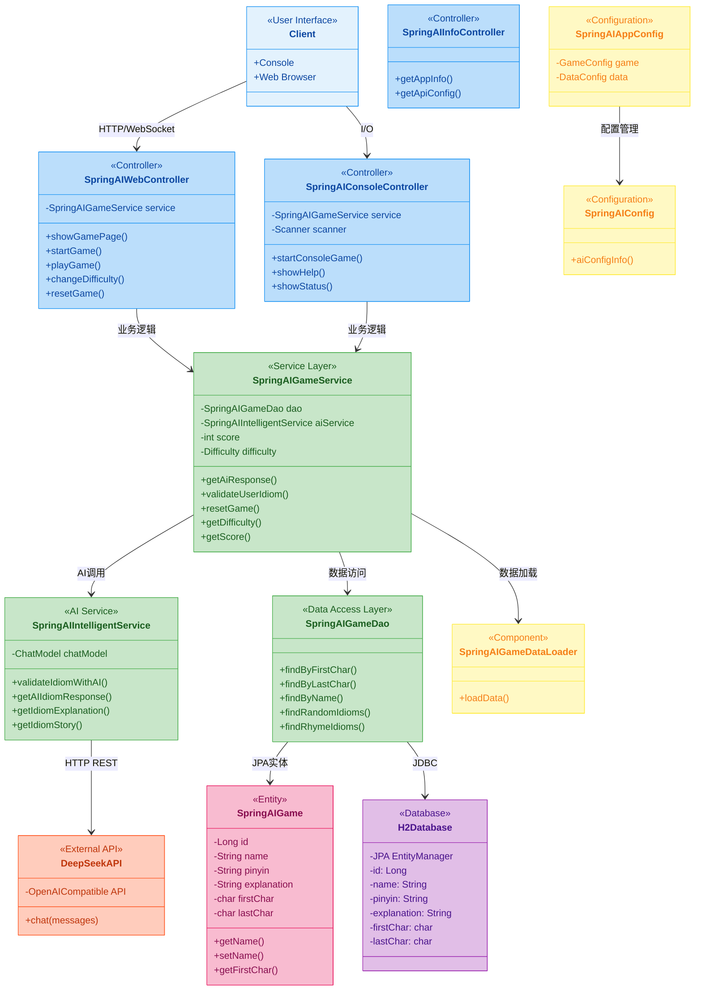
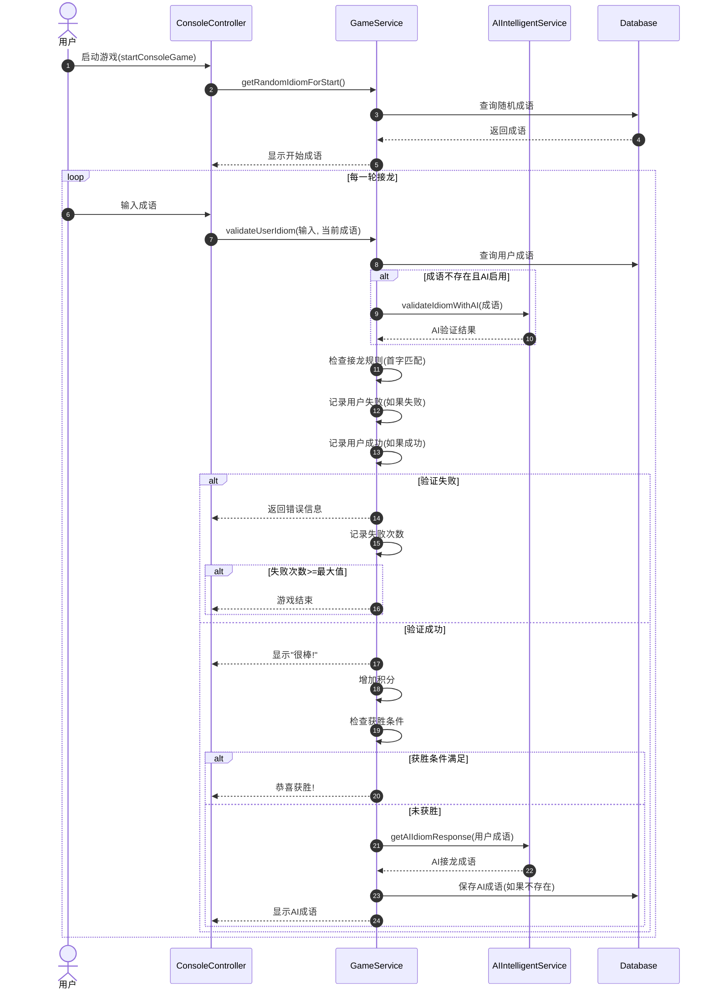
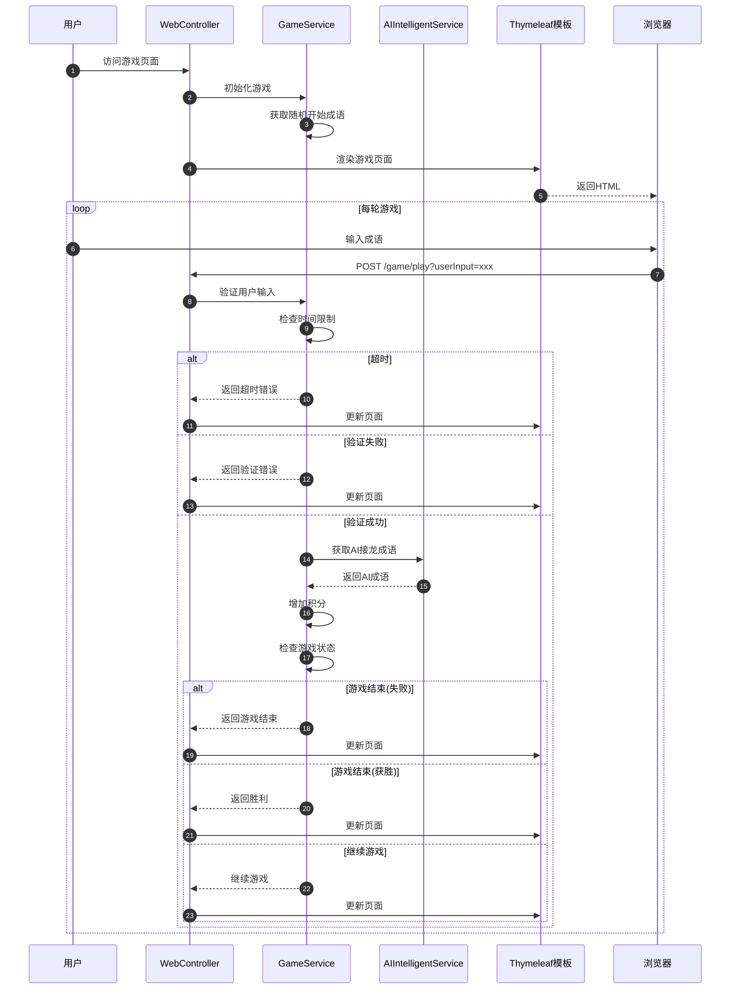
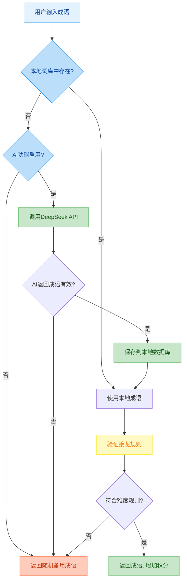
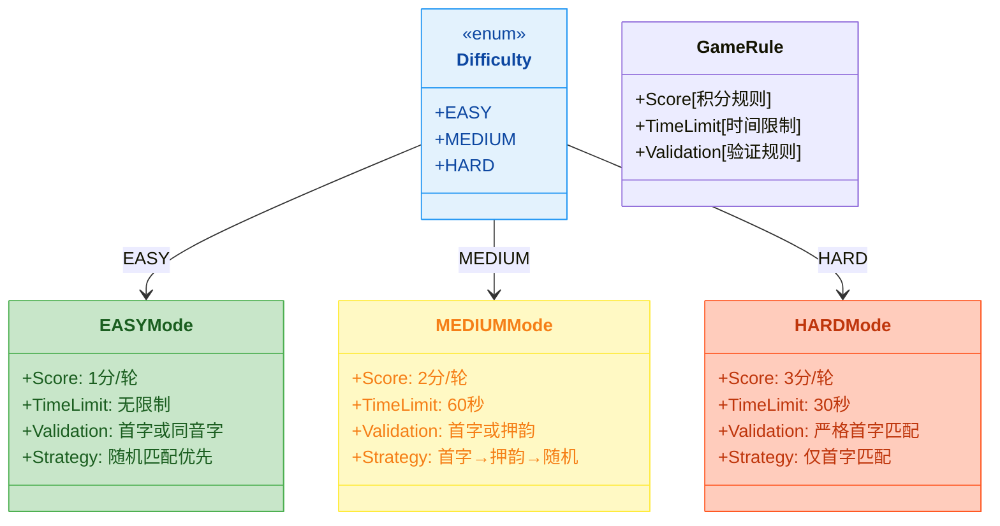
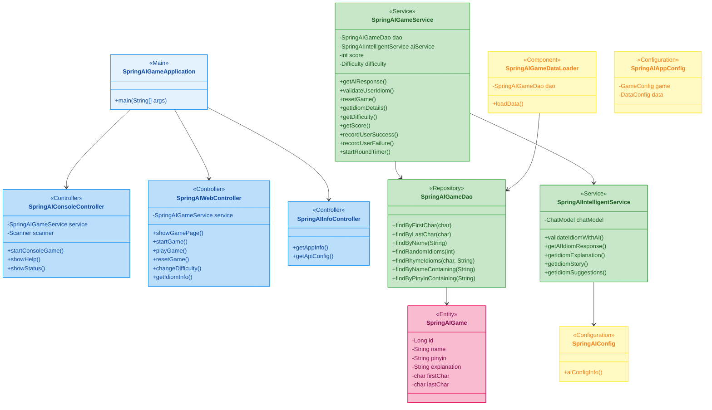

# 基于AI的智能成语挑战赛项目完结

作者：冰河
<br/>星球：[http://m6z.cn/6aeFbs](http://m6z.cn/6aeFbs)
<br/>博客：[https://binghe.gitcode.host](https://binghe.gitcode.host)
<br/>文章汇总：[https://binghe.gitcode.host/md/all/all.html](https://binghe.gitcode.host/md/all/all.html)
<br/>源码获取地址：[https://t.zsxq.com/0dhvFs5oR](https://t.zsxq.com/0dhvFs5oR)

> 沉淀，成长，突破，帮助他人，成就自我。

**大家好，我是冰河~~**

## 一、前言

在完成《[多轮AI智能对话系统](https://articles.zsxq.com/id_44gao6eti511.html)》项目后，冰河又要带着大家搞新项目了，这也是 **冰河技术** 知识星球继《[一站式AI智能平台](https://articles.zsxq.com/id_xn1wzdt73273.html)》、《[AI智能客服系统](https://articles.zsxq.com/id_6z4v8x6mkbbo.html)》、《[AI智能问答系统](https://articles.zsxq.com/id_udbbmkg7zmz5.html)》、《[高性能Redis组件](https://articles.zsxq.com/id_7f7wo3mi8cpi.html)》、《[实战AI大模型](https://articles.zsxq.com/id_qphoao81fc48.html)》、《[手写高性能脱敏组件](https://mp.weixin.qq.com/s/wUtCJ_WpNkRow_xEnDJajw)》、《[手写线程池](https://mp.weixin.qq.com/s/xJo-TIa7wob3OVShXZCFgQ)》、《[手写高性能SQL引擎](https://articles.zsxq.com/id_tx01uwlh582w.html)》、[《手写高性能Polaris网关》](https://mp.weixin.qq.com/s/7OXf9DD5ATtZPiLaujFnHQ)、[《手写高性能RPC》](https://mp.weixin.qq.com/s/7DkT5hWw8XHqqWV3JkX7pg)、 [《Seckill秒杀系统》](https://mp.weixin.qq.com/s/FwUR0jSaaSqyOc_xNhaKxw) 和[《分布式IM即时通讯系统》](https://mp.weixin.qq.com/s/i09JzlSsYmGQlXvbSFjCbA)、《[手写高性能熔断组件](https://articles.zsxq.com/id_zuv6si9ztzb2.html)》、《[手写高性能监控组件](https://articles.zsxq.com/id_3550o56rw2uz.html)》、《[简易商城脚手架](https://mp.weixin.qq.com/mp/appmsgalbum?__biz=Mzg4MjU0OTM1OA==&action=getalbum&album_id=2337104419664084992&scene=173&from_msgid=2247500059&from_itemidx=1&count=3&nolastread=1#wechat_redirect)》等诸多项目后，又一个带着大家从零开始手写的AI大模型项目。星球其他项目与专栏，大家可移步到冰河的个人站点：[https://binghe.gitcode.host](https://binghe.gitcode.host) 进行查看。

<div align="center">
    
   <br/>
</div>

没错，冰河这次已经撸完了这个项目，你要做的，就是跟着这篇文章的核心内容，对照着代码自己手撸一遍。

## 二、项目背景

### 2.1 为什么要做这个项目？

古人云："书山有路勤为径，学海无涯苦作舟"，但如果你在学编程的路上碰壁了怎么办？别担心，我们用AI带你"乘风破浪"！这个项目不是来教你怎么背成语的，而是来教你**怎么用Spring AI大模型 API来开发智能应用**的！是的，你没看错，这就是一个集游戏、学习、技术于一体的项目——这就是星球要带你玩的新花样！

### 2.2 现实痛点

你有没有想过：

1. 想玩成语接龙，但找不到AI对手
2. 想学习成语，但不想啃枯燥的字典
3. 想实践Spring AI API调用，但不想从Hello World开始

于是就有了这个项目！

## 三、技术选型

| 技术             | 选型理由                              |
| ---------------- | ------------------------------------- |
| **Spring Boot**  | 快速开发的必备神器，省去配置烦恼      |
| **Spring AI**    | 官方AI框架，集成大模型如DeepSeek      |
| **JPA + H2**     | 数据库ORM方案，H2内存数据库，开箱即用 |
| **Thymeleaf**    | 服务端渲染，轻量级Web界面             |
| **DeepSeek API** | 性价比超高的大模型，比GPT便宜多了     |

所以，这个项目不仅仅是一个成语接龙游戏，更是一个完整的学习案例。通过这个项目，你可以学到：

* **Spring Boot开发**：快速搭建Web应用

* **Spring AI集成**：如何调用大模型API

* **分层架构设计**：Controller-Service-DAO模式

* **异常处理与降级**：提高系统健壮性

* **性能优化**：数据库索引、缓存策略

* **工程化实践**：代码规范、日志记录、测试

**推荐学习路径如下**

```
入门阶段
  ↓
1. Spring Boot基础
2. RESTful API开发
3. Thymeleaf模板引擎
  ↓
进阶阶段
  ↓
1. Spring Data JPA
2. 数据库设计
3. 异常处理与日志
  ↓
高级阶段
  ↓
1. Spring AI集成
2. 限流降级策略
3. 性能优化
4. 架构设计
```

## 四、项目亮点

项目核心亮点

### 4.1 双模式游戏体验

- **控制台模式**：适合喜欢简单直接的玩家
- **Web模式**：现代化的用户界面，视觉效果更佳
- **快速切换**：在控制台输入`web`即可无缝切换

### 4.2 智能AI对手

- **本地词库优先**：响应速度快，无需等待API
- **AI智能补充**：本地找不到时调用DeepSeek API
- **自动学习**：AI生成的成语自动保存到本地词库
- **多难度适配**：简单、中等、困难三种模式

### 4.3 完善的游戏机制

- **积分系统**：根据难度获得不同积分
- **时间限制**：中等60秒、困难30秒
- **失败惩罚**：连续失败3次游戏结束
- **获胜条件**：连续成功10次即获胜

### 4.4 模块化架构

```
┌─────────────────────────────────────────────┐
│  Controller Layer (展示层)                    │
│  ├─ Console Controller                       │
│  ├─ Web Controller                           │
│  └─ Info Controller                          │
├─────────────────────────────────────────────┤
│  Service Layer (业务层)                       │
│  ├─ Game Service                             │
│  └─ AI Service                               │
├─────────────────────────────────────────────┤
│  DAO Layer (数据访问层)                       │
│  └─ Idiom DAO                                │
├─────────────────────────────────────────────┤
│  Persistence Layer (持久层)                   │
│  ├─ Entity (SpringAIGame)                    │
│  ├─ Database (H2)                            │
│  └─ External API (DeepSeek)                  │
└─────────────────────────────────────────────┘
```

## 五、学习价值

### 5.1 对于初学者

1. **完整项目结构**：从零开始，学会如何组织代码
2. **分层架构**：理解MVC设计模式
3. **配置管理**：学会使用YAML配置文件
4. **异常处理**：学会如何优雅地处理异常

### 5.2 对于进阶者

1. **AI集成**：学习Spring AI与大模型API的集成
2. **高并发设计**：限流、降级、缓存策略
3. **性能优化**：数据库索引、查询优化
4. **可扩展性**：设计易于扩展的架构

### 5.3 对于架构师

1. **系统设计**：从需求到架构的完整设计过程
2. **技术选型**：根据场景选择合适的技术
3. **容错设计**：多级降级、熔断机制
4. **监控体系**：日志、监控、告警

## 六、学习目标

完成这个项目后，大家将掌握：

### 6.1 技术技能

- Spring Boot项目搭建与配置
- Spring AI集成与DeepSeek API调用
- JPA/H2数据库操作与数据加载
- RESTful API设计与实现
- Thymeleaf模板引擎使用
- 控制台与Web双模式实现
- Session管理与会话状态维护
- 时间限制与游戏规则实现

### 6.2 业务能力

- 成语接龙游戏规则设计
- 多难度模式设计（简单/中等/困难）
- 积分系统设计
- 限流降级策略（基于Spring AI能力）
- 数据库设计与建表SQL
- 异常处理与容错机制

### 6.3 思维提升

- 从零设计完整游戏系统
- AI能力与业务场景结合
- 高并发思维（虽然当前项目小，但架构要能扛住）
- 面向对象设计思想
- 架构可扩展性思考

## 七、技术架构

### 7.1 设计模式应用

| 设计模式           | 应用位置            | 作用               |
| ------------------ | ------------------- | ------------------ |
| **Repository模式** | SpringAIGameDao     | 封装数据访问逻辑   |
| **Service模式**    | SpringAIGameService | 封装业务逻辑       |
| **Controller模式** | Controllers         | 接收请求，响应结果 |
| **Strategy模式**   | Difficulty枚举      | 不同难度策略       |
| **Template方法**   | PromptTemplate      | AI提示词模板       |

### 7.2 技术栈总结

```
后端框架
├─ Spring Boot 3.x
├─ Spring AI
├─ Spring Data JPA
├─ Spring MVC
└─ Spring Framework

数据库
├─ H2 (内存数据库)
└─ JPA/Hibernate

AI模型
└─ DeepSeek API (兼容OpenAI格式)

模板引擎
└─ Thymeleaf

前端技术
├─ HTML5
├─ CSS3
└─ JavaScript

构建工具
└─ Maven
```

## 八、项目架构

### 8.1 整体类结构图



### 8.2 架构分层说明

```
┌─────────────────────────────────────────────────────────┐
│                    Presentation Layer                     │
│  ┌──────────────┐  ┌──────────────┐  ┌──────────────┐   │
│  │ Web Controller│  │Console Controller│  │ Info Controller│   │
│  └──────┬───────┘  └──────┬────────┘  └──────┬───────┘   │
└─────────┼────────────────┼─────────────────┼────────────┘
          │                │                 │
┌─────────┼────────────────┼─────────────────┼────────────┐
│      Business Logic Layer                            │
│  ┌────────────────────────────────────────────────┐   │
│  │            SpringAIGameService                 │   │
│  │  - 游戏规则验证                                   │   │
│  │  - 难度控制                                     │   │
│  │  - 积分计算                                     │   │
│  │  - 时间管理                                     │   │
│  └──────────────┬─────────────────────────────────┘   │
│                 │                                       │
│  ┌──────────────┴─────────────────────────────────┐   │
│  │      SpringAIIntelligentService                │   │
│  │  - AI成语验证                                   │   │
│  │  - AI成语接龙                                   │   │
│  │  - 成语解释获取                                 │   │
│  └──────────────┬─────────────────────────────────┘   │
└─────────────────┼─────────────────────────────────────┘
                  │
┌─────────────────┼─────────────────────────────────────┐
│         Data Access Layer                            │
│  ┌────────────────────────────────────────────────┐   │
│  │            SpringAIGameDao                     │   │
│  │  - 成语查询                                     │   │
│  │  - 随机成语                                     │   │
│  │  - 押韵查询                                     │   │
│  └──────────────┬─────────────────────────────────┘   │
│                 │                                       │
│  ┌──────────────┴─────────────────────────────────┐   │
│  │         SpringAIGameDataLoader                  │   │
│  │  - CSV数据加载                                   │   │
│  │  - 数据库初始化                                 │   │
│  └────────────────────────────────────────────────┘   │
└─────────────────┼─────────────────────────────────────┘
                  │
┌─────────────────┼─────────────────────────────────────┐
│         Persistence Layer                             │
│  ┌────────────────────────────────────────────────┐   │
│  │           SpringAIGame (Entity)                 │   │
│  │           H2Database (JPA)                      │   │
│  └────────────────────────────────────────────────┘   │
│                 │                                       │
│  ┌──────────────┴─────────────────────────────────┐   │
│  │           DeepSeek API                          │   │
│  │  - 外部大模型调用                                 │   │
│  └────────────────────────────────────────────────┘   │
└───────────────────────────────────────────────────────┘
```

## 九、项目执行流程

### 9.1 控制台游戏流程



### 9.2 Web游戏流程



### 8.3 AI接龙策略流程图



### 8.4 难度等级设计



## 十、项目结构

### 10.1 目录结构

```
spring-ai-game-chengyu/
├── src/
│   ├── main/
│   │   ├── java/io/binghe/ai/game/
│   │   │   ├── SpringAIGameApplication.java      # 应用启动类
│   │   │   │
│   │   │   ├── controller/                       # 控制器层
│   │   │   │   ├── SpringAIConsoleController.java   # 控制台控制器
│   │   │   │   ├── SpringAIWebController.java       # Web控制器
│   │   │   │   └── SpringAIInfoController.java      # 信息控制器
│   │   │   │
│   │   │   ├── service/                          # 业务逻辑层
│   │   │   │   ├── SpringAIGameService.java        # 游戏服务
│   │   │   │   └── SpringAIIntelligentService.java  # AI智能服务
│   │   │   │
│   │   │   ├── dao/                              # 数据访问层
│   │   │   │   ├── SpringAIGameDao.java           # 成语数据访问接口
│   │   │   │   └── SpringAIGameDataLoader.java    # 数据加载器
│   │   │   │
│   │   │   ├── model/                            # 实体模型层
│   │   │   │   └── SpringAIGame.java              # 成语实体
│   │   │   │
│   │   │   ├── constants/                        # 常量定义
│   │   │   │   └── SpringAIGameConstants.java     # 游戏常量
│   │   │   │
│   │   │   └── config/                           # 配置类
│   │   │       ├── SpringAIConfig.java            # AI配置
│   │   │       └── SpringAIAppConfig.java         # 应用配置
│   │   │
│   │   ├── resources/
│   │   │   ├── application.yml                    # 应用配置文件
│   │   │   ├── data/
│   │   │   │   └── idioms.csv                     # 成语数据文件(CSV)
│   │   │   ├── templates/
│   │   │   │   └── game.html                      # 游戏页面模板
│   │   │   └── static/
│   │   │       ├── css/
│   │   │       │   └── game.css                   # 样式文件
│   │   │       └── js/
│   │   │           └── game.js                    # 前端脚本
│   │   └── test/
│   │       └── resources/
│   │           └── data/
│   │               └── game.csv                   # 测试数据文件
│   └── test/
│       └── java/
│           └── ...                                 # 测试代码
│
├── pom.xml                                         # Maven依赖配置
└── README.md                                       # 项目说明
```

### 10.2 包结构说明

```
io.binghe.ai.game/
├── SpringAIGameApplication.java          # 主应用类
├── controller/                          # 控制器包
│   ├── SpringAIConsoleController.java   # 控制台游戏控制器
│   ├── SpringAIWebController.java       # Web游戏控制器
│   └── SpringAIInfoController.java      # API信息控制器
├── service/                             # 服务层
│   ├── SpringAIGameService.java         # 核心游戏服务
│   └── SpringAIIntelligentService.java  # AI智能服务
├── dao/                                 # 数据访问层
│   ├── SpringAIGameDao.java             # 成语DAO接口
│   └── SpringAIGameDataLoader.java      # 数据加载器
├── model/                               # 实体模型层
│   └── SpringAIGame.java                # 成语实体
├── constants/                           # 常量定义
│   └── SpringAIGameConstants.java       # 游戏常量
└── config/                              # 配置层
    ├── SpringAIConfig.java              # AI配置
    └── SpringAIAppConfig.java           # 应用配置
```

## 十一、核心类实现关系

### 11.1 类图关系



### 11.2 关键依赖关系

```
SpringAIWebController
    ├─> 依赖 SpringAIGameService (业务逻辑)
    └─> 依赖 SpringAIGameDao (数据访问)

SpringAIConsoleController
    ├─> 依赖 SpringAIGameService (业务逻辑)
    └─> 依赖 SpringAIGameDao (数据访问)

SpringAIGameService
    ├─> 依赖 SpringAIGameDao (本地成语查询)
    ├─> 依赖 SpringAIIntelligentService (AI调用)
    ├─> 依赖 SpringAIGameDataLoader (数据加载)
    └─> 依赖 SpringAIAppConfig (配置管理)

SpringAIIntelligentService
    ├─> 依赖 ChatModel (Spring AI框架)
    └─> 依赖 SpringAIConfig (AI配置)

SpringAIGameDao
    └─> 依赖 SpringAIGame (JPA实体)

SpringAIGame
    └─> 依赖 JPA注解 (@Entity, @Table)

SpringAIGameDataLoader
    └─> 依赖 SpringAIGameDao (数据持久化)
```

## 十二、核心编码实现

## 查看完整文章

加入[冰河技术](https://public.zsxq.com/groups/48848484411888.html)知识星球，解锁完整技术文章、小册、视频与完整代码

## 写在最后

在冰河技术知识星球， **《AI智能代码审查平台》** 已完结，同时，**《AI全链路短剧生成平台》、《智能代码审查系统》** 已完结， **《多智能体协作与AI工作台》** 项目热更中，还有其他二十几个项目，像实战Claude Code、AI知识库系统、智流助手平台、智能成语挑战赛项目、多轮AI智能对话系统、一站式AI智能平台、AI智能客服系统、AI智能问答系统、实战AI大模型、手写高性能敏组件、手写线程池、手写高性能SQL引擎、手写高性能Polaris网关、手写高性能熔断组件、手写通用指标上报组件、手写高性能数据库路由组件、手写分布式IM即时通讯系统、手写Seckill分布式秒杀系统、手写高性能RPC、实战高并发设计模式、简易商城系统等等。

这些项目的需求、方案、架构、落地等均来自互联网真实业务场景，让你真正学到互联网大厂的业务与技术落地方案，并将其有效转化为自己的知识储备。

**值得一提的是：冰河自研的Polaris高性能网关比某些开源网关项目性能更高，目前正在热更AI一体化项目，也正在实现MCP，全程带你分析原理和手撸代码。**

你还在等啥？不少小伙伴经过星球硬核技术和项目的历练，早已成功跳槽加薪，实现薪资翻倍，而你，还在原地踏步，抱怨大环境不好。抛弃焦虑和抱怨，我们一起塌下心来沉淀硬核技术和项目，让自己的薪资更上一层楼。

🚀PS：**目前已开通最大优惠：长按或扫码加入星球立减30，注意：随着项目和专栏的更新，星球也即将涨价！！**

<div align="center">
    
    <div style="font-size: 18px;"></div>
    <br/>
</div>

目前，领券加入星球就可以跟冰河一起学习《实战Claude Code》、《多轮AI智能对话系统》、《一站式AI智能平台》、《AI智能客服系统》、《AI智能问答系统》、《实战AI大模型》、《手写高性能Redis组件》、《手写高性能脱敏组件》、《手写线程池》、《手写高性能SQL引擎》、《手写高性能Polaris网关》、《手写高性能RPC项目》、《分布式Seckill秒杀系统》、《分布式IM即时通讯系统》《手写高性能通用熔断组件项目》、《手写高性能通用监控指标上报组件》、《手写高性能数据库路由组件》、《手写简易商城脚手架项目》、《Spring6核心技术与源码解析》和《实战高并发设计模式》，从零开始介绍原理、设计架构、手撸代码。

**花很少的钱就能学这么多硬核技术、中间件项目和大厂秒杀系统、分布式IM即时通讯系统，AI大模型项目，比其他培训机构不知便宜多少倍，硬核多少倍，如果是我，我会买他个十年！**

加入要趁早，后续还会随着项目和加入的人数涨价，而且只会涨，不会降，先加入的小伙伴就是赚到。

另外，还有一个限时福利，邀请一个小伙伴加入，冰河就会给一笔 **分享有奖** ，有些小伙伴都邀请了50+人，早就回本了！

## 其他方式加入星球

- **链接** ：打开链接 http://m6z.cn/6aeFbs 加入星球。
- **回复** ：在公众号 **冰河技术** 回复 **星球** 领取优惠券加入星球。

**特别提醒：** 苹果用户进圈或续费，请加微信 **hacker_binghe** 扫二维码，或者去公众号 **冰河技术** 回复 **星球** 扫二维码加入星球。

**好了，今天就到这儿吧，我是冰河，我们下期见~~**