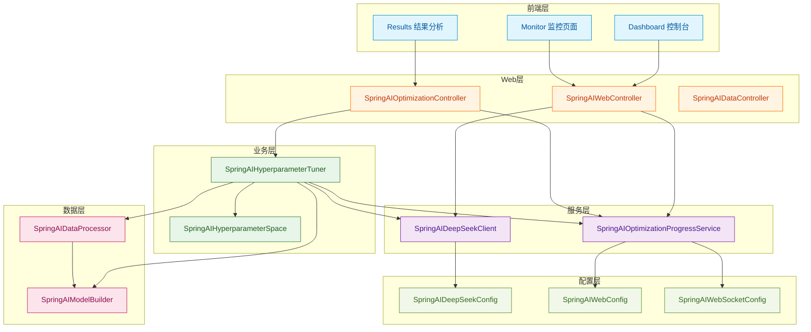
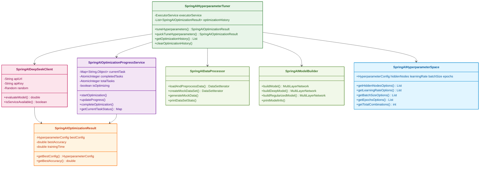
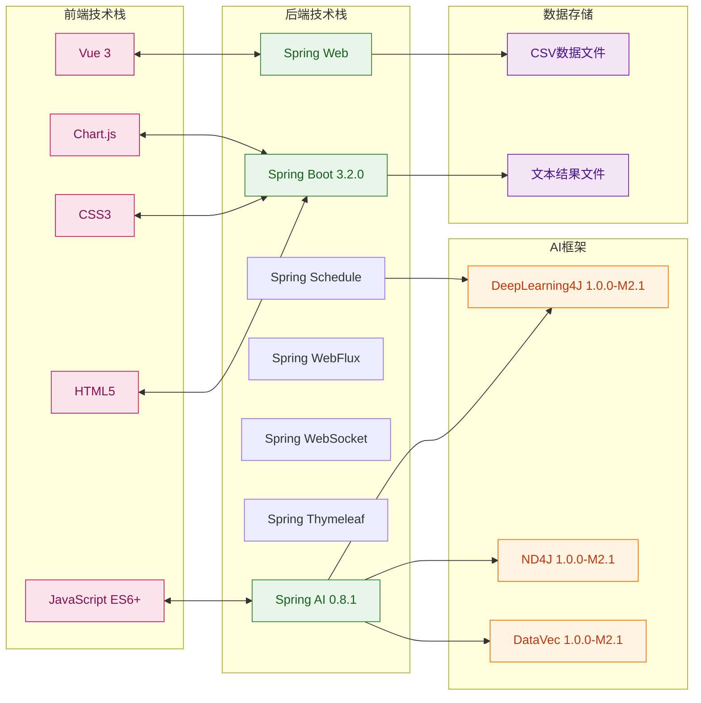
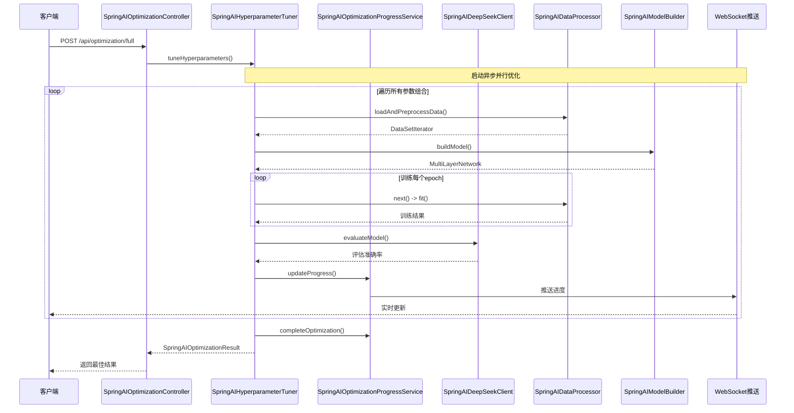
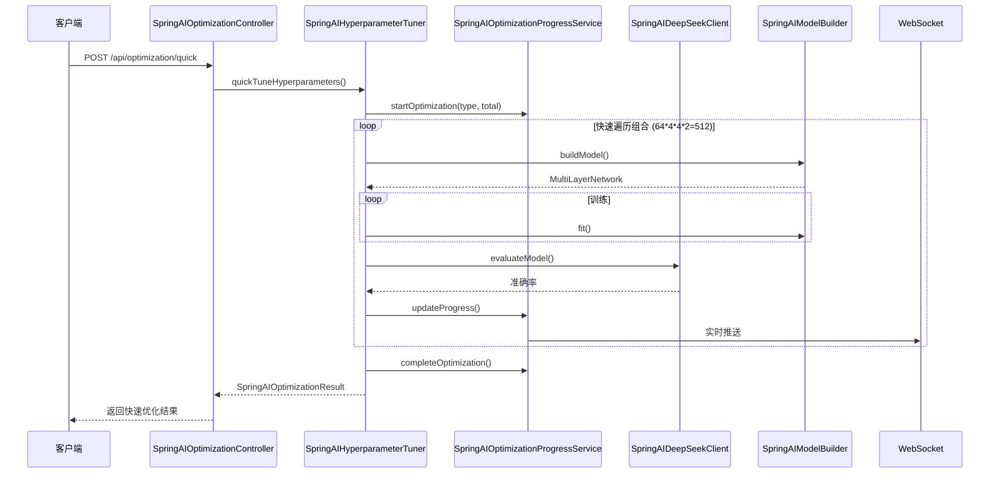
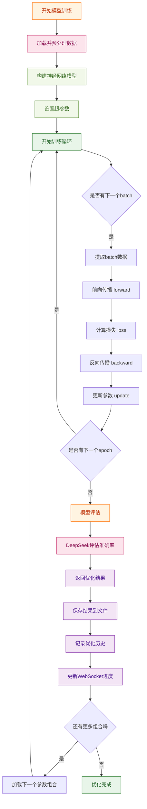

# 《AI优化-智能化机器学习平台》-总结：AI优化-智能化机器学习（模型训练与评估）平台整体总结

作者：冰河
 星球：[http://m6z.cn/6aeFbs](http://m6z.cn/6aeFbs)
 博客：[https://binghe.gitcode.host](https://binghe.gitcode.host)
 文章汇总：[https://binghe.gitcode.host/md/all/all.html](https://binghe.gitcode.host/md/all/all.html)
 源码获取地址：[https://t.zsxq.com/0dhvFs5oR](https://t.zsxq.com/0dhvFs5oR)

> 沉淀，成长，突破，帮助他人，成就自我。

**大家好，我是冰河~~**

## 一、前言

在完成《[基于AI的智能成语挑战赛](https://articles.zsxq.com/id_7gw9caqh1ww2.html)》项目后，冰河又要带着大家搞新项目了，这也是 **冰河技术** 知识星球继《[多轮AI智能对话系统](https://articles.zsxq.com/id_44gao6eti511.html)》、《[一站式AI智能平台](https://articles.zsxq.com/id_xn1wzdt73273.html)》、《[AI智能客服系统](https://articles.zsxq.com/id_6z4v8x6mkbbo.html)》、《[AI智能问答系统](https://articles.zsxq.com/id_udbbmkg7zmz5.html)》、《[高性能Redis组件](https://articles.zsxq.com/id_7f7wo3mi8cpi.html)》、《[实战AI大模型](https://articles.zsxq.com/id_qphoao81fc48.html)》、《[手写高性能脱敏组件](https://mp.weixin.qq.com/s/wUtCJ_WpNkRow_xEnDJajw)》、《[手写线程池](https://mp.weixin.qq.com/s/xJo-TIa7wob3OVShXZCFgQ)》、《[手写高性能SQL引擎](https://articles.zsxq.com/id_tx01uwlh582w.html)》、[《手写高性能Polaris网关》](https://mp.weixin.qq.com/s/7OXf9DD5ATtZPiLaujFnHQ)、[《手写高性能RPC》](https://mp.weixin.qq.com/s/7DkT5hWw8XHqqWV3JkX7pg)、 [《Seckill秒杀系统》](https://mp.weixin.qq.com/s/FwUR0jSaaSqyOc_xNhaKxw) 和[《分布式IM即时通讯系统》](https://mp.weixin.qq.com/s/i09JzlSsYmGQlXvbSFjCbA)、《[手写高性能熔断组件](https://articles.zsxq.com/id_zuv6si9ztzb2.html)》、《[手写高性能监控组件](https://articles.zsxq.com/id_3550o56rw2uz.html)》、《[简易商城脚手架](https://mp.weixin.qq.com/mp/appmsgalbum?__biz=Mzg4MjU0OTM1OA==&action=getalbum&album_id=2337104419664084992&scene=173&from_msgid=2247500059&from_itemidx=1&count=3&nolastread=1#wechat_redirect)》等诸多项目后，又一个带着大家从零开始手写的AI大模型项目。星球其他项目与专栏，大家可移步到冰河的个人站点：[https://binghe.gitcode.host](https://binghe.gitcode.host) 进行查看。

    
     

没错，冰河这次已经撸完了这个项目，你要做的，就是跟着这篇文章的核心内容，对照着代码自己手撸一遍。这就像学开车——光看说明书没用，得自己上车踩油门才行，对吧？

## 二、项目说明

### 2.1 项目定义

本项目是冰河带着大家手撸的**AI大模型应用项目**，是全网首个基于**Spring AI**和**DeepSeek**的深度学习模型AI优化实战平台。

简单来说，这就是一个"AI调参神器"！想象一下，你有一个深度学习模型，但是不知道怎么调参数才能让它性能最好。传统的方法是靠"猜"，就像瞎子摸象一样，效率低、成本高。有了这个平台，就像有了个"AI调酒师"，能够智能地调配出最佳的模型参数组合，让你的模型性能飙升！

咱们打个比方：传统调参就像你瞎蒙哪个杯子里的水是甜的，而有了这个平台，就像是给了你一个AI品酒师，帮你找到那杯最甜的"水"。

### 2.2 项目定位

- **技术定位**: AI大模型应用项目
- **应用场景**: 电商用户行为预测、客户流失预警、信用评分模型
- **技术栈**: Spring AI + DeepSeek + DeepLearning4J + Spring Boot
- **核心功能**: AI参数自动优化、模型性能评估、实时进度监控

## 三、项目背景

### 3.1 为什么需要这个项目？

在AI领域，**调参**是每个机器学习工程师最头疼的事情。为什么这么难？因为参数太多、组合爆炸、耗时长、易出错！

就拿这个项目来说，光基础搜索空间就有：

- 隐藏层节点：64, 96, 128, 160, 192, 256（6种）
- 学习率：0.001, 0.0001, 0.00001, 0.01（4种）
- 批次大小：16, 32, 64, 128（4种）
- 训练轮数：5, 10（2种）

**总组合数 = 6 × 4 × 4 × 2 = 192种**！手动测试需要数周时间，而且还不一定找到最优配置。

想象一下，你要从192种咖啡配方里找到最好喝的那一种，是不是头都大了？如果用这个平台，就相当于给你开了个"咖啡调酒小助手"，帮你快速找到最佳配方。

### 3.2 技术背景

传统的深度学习模型优化面临以下挑战：

1. **参数空间爆炸**：参数越多，组合越多，搜索难度呈指数级增长——就像在俄罗斯套娃里找钥匙，越找越懵
2. **评估耗时长**：每个参数组合都要重新训练模型，耗时巨大——训练一个模型就像炖一锅汤，慢工出细活，但如果你要试192次？那得等到明年去了
3. **缺乏可视化**：看不到优化进度，心里没底——就像煮汤不知道火候，完全靠直觉
4. **手动调参效率低**：依赖经验，难以找到全局最优——经验这东西，有时候靠得住，有时候靠不住

### 3.3 解决方案

本项目提供了一个**自动化AI参数优化平台**：

- **智能搜索**：遍历所有参数组合，找到最优配置——就像给你装了个"智能导航"，不用自己迷路
- **并行评估**：多线程并发训练，大幅提升效率——4个线程一起干活，效率直接翻4倍，这不是追求速度是图啥？
- **实时监控**：WebSocket实时推送优化进度——像看直播一样实时掌握进度，不再干等
- **可视化界面**：Dashboard控制台、Monitor监控、Results结果分析——视觉化展示，一目了然
- **REST API**：提供标准化的HTTP接口，易于集成——给你一个统一的API，随便你调用

## 四、学习目标

### 4.1 AI应用开发核心技能

通过本项目，你将掌握：

- **AI大模型集成**：学习如何将Spring AI与DeepSeek无缝对接——这不是简单的"握手"，而是"无缝拥抱"
- **深度学习框架应用**：掌握DeepLearning4J进行神经网络构建和训练——像搭积木一样搭建神经网络
- **超参数优化策略**：理解并实现高效的参数搜索算法——学会AI的"调参心法"
- **异步并行计算**：利用CompletableFuture实现高性能并行训练——学会让代码"并行思考"

### 4.2 Spring生态深度掌握

- **Spring Boot自动化配置**：优雅地管理AI依赖和配置——把Spring Boot当你的"万能管家"
- **Spring MVC REST API**：构建高性能的HTTP接口——写接口就像写诗，优雅又高效
- **Spring WebSocket**：实现实时数据推送——消息推送就像"火箭发射"，实时到位
- **Spring Thymeleaf**：构建响应式Web界面——页面像水一样流畅，想咋改就咋改
- **Spring Schedule**：实现定时任务调度——任务定时执行，不用你盯着看

### 4.3 架构设计能力

- **分层架构设计**：清晰的项目结构和职责划分——架构清晰，代码不会"乱成一锅粥"
- **微服务设计思想**：解耦、可扩展、易维护——让系统像乐高积木，想拆就拆，想装就装
- **实时监控设计**：WebSocket + 前端图表可视化——数据看得见，心里不慌张
- **日志系统设计**：完善的日志记录和监控——问题来了，一眼就能找到"罪魁祸首"

## 五、项目亮点

### 5.1 项目亮点

**Spring AI + DeepSeek集成**

- 将Spring AI框架与国产DeepSeek模型无缝对接
- 实现了AI大模型与深度学习框架的有机结合——这就好比把"引擎"和"底盘"完美结合，跑起来特别稳

**异步并行优化**

- 使用`ExecutorService`和`CompletableFuture`实现多线程并行训练
- 4个线程并发评估参数组合，大幅提升效率——4个人一起干活，效率直接翻4倍

**智能搜索空间**

- 定义了192种参数组合（基础搜索空间）
- 支持扩展搜索空间，支持更多参数维度——就像给你加了个"扩容包"

**实时进度监控**

- WebSocket实时推送优化进度
- 前端实时展示进度条、准确率、当前配置——像看奥运会比赛一样实时掌握进度

**完整的REST API**

- 提供快速优化、完整优化、历史查询等接口
- 标准化的JSON响应格式——接口规范统一，想怎么用都行

### 5.2 学习价值

通过本项目，你将学到：

#### 5.2.1 AI开发技能

- AI大模型集成：学会将Spring AI与各种AI模型集成——不是简单的"插拔式"集成，而是"深度融合"
- 深度学习基础：掌握DeepLearning4J进行神经网络构建和训练——神经网络不是"玄学"，是可以"科学构建"的
- 超参数优化：理解并实现高效的参数搜索策略——调参不是"玄学"，是有章可循的
- 异步编程：使用CompletableFuture实现异步任务编排——让代码"多线程思考"

#### 5.2.2 Spring生态技能

- Spring Boot自动化配置——让Spring Boot当你的"万能管家"
- Spring MVC REST API开发——写接口就像写诗，优雅又高效
- Spring WebSocket实时推送——消息推送就像"火箭发射"
- Spring Thymeleaf模板引擎——页面渲染，行云流水

#### 5.2.3 架构设计技能

- 分层架构设计——架构清晰，代码不会"乱成一锅粥"
- 异步并行设计——4个线程一起干活，效率直接翻4倍
- 实时监控设计——数据看得见，心里不慌张
- REST API设计——接口规范统一，想怎么用都行

## 六、项目架构

### 6.1 整体架构图

### 6.2 核心组件架构

### 6.3 技术栈架构

## 七、项目执行流程

### 7.1 完整优化流程时序图

### 7.2 快速优化流程时序图

### 7.3 模型训练与评估流程

## 八、项目结构

## 查看完整文章

加入[冰河技术](https://public.zsxq.com/groups/48848484411888.html)知识星球，解锁完整技术文章、小册、视频与完整代码

## 写在最后

在冰河技术知识星球， **《AI智能代码审查平台》** 已完结，同时，**《AI全链路短剧生成平台》、《智能代码审查系统》** 已完结， **《多智能体协作与AI工作台》** 项目热更中，还有其他二十几个项目，像实战Claude Code、AI知识库系统、智流助手平台、智能成语挑战赛项目、多轮AI智能对话系统、一站式AI智能平台、AI智能客服系统、AI智能问答系统、实战AI大模型、手写高性能敏组件、手写线程池、手写高性能SQL引擎、手写高性能Polaris网关、手写高性能熔断组件、手写通用指标上报组件、手写高性能数据库路由组件、手写分布式IM即时通讯系统、手写Seckill分布式秒杀系统、手写高性能RPC、实战高并发设计模式、简易商城系统等等。

这些项目的需求、方案、架构、落地等均来自互联网真实业务场景，让你真正学到互联网大厂的业务与技术落地方案，并将其有效转化为自己的知识储备。

**值得一提的是：冰河自研的Polaris高性能网关比某些开源网关项目性能更高，目前正在热更AI一体化项目，也正在实现MCP，全程带你分析原理和手撸代码。**

你还在等啥？不少小伙伴经过星球硬核技术和项目的历练，早已成功跳槽加薪，实现薪资翻倍，而你，还在原地踏步，抱怨大环境不好。抛弃焦虑和抱怨，我们一起塌下心来沉淀硬核技术和项目，让自己的薪资更上一层楼。

🚀PS：**目前已开通最大优惠：长按或扫码加入星球立减30，注意：随着项目和专栏的更新，星球也即将涨价！！**

    
    

     

目前，领券加入星球就可以跟冰河一起学习《实战Claude Code》、《多轮AI智能对话系统》、《一站式AI智能平台》、《AI智能客服系统》、《AI智能问答系统》、《实战AI大模型》、《手写高性能Redis组件》、《手写高性能脱敏组件》、《手写线程池》、《手写高性能SQL引擎》、《手写高性能Polaris网关》、《手写高性能RPC项目》、《分布式Seckill秒杀系统》、《分布式IM即时通讯系统》《手写高性能通用熔断组件项目》、《手写高性能通用监控指标上报组件》、《手写高性能数据库路由组件》、《手写简易商城脚手架项目》、《Spring6核心技术与源码解析》和《实战高并发设计模式》，从零开始介绍原理、设计架构、手撸代码。

**花很少的钱就能学这么多硬核技术、中间件项目和大厂秒杀系统、分布式IM即时通讯系统，AI大模型项目，比其他培训机构不知便宜多少倍，硬核多少倍，如果是我，我会买他个十年！**

加入要趁早，后续还会随着项目和加入的人数涨价，而且只会涨，不会降，先加入的小伙伴就是赚到。

另外，还有一个限时福利，邀请一个小伙伴加入，冰河就会给一笔 **分享有奖** ，有些小伙伴都邀请了50+人，早就回本了！

## 其他方式加入星球

- **链接** ：打开链接 http://m6z.cn/6aeFbs 加入星球。
- **回复** ：在公众号 **冰河技术** 回复 **星球** 领取优惠券加入星球。

**特别提醒：** 苹果用户进圈或续费，请加微信 **hacker_binghe** 扫二维码，或者去公众号 **冰河技术** 回复 **星球** 扫二维码加入星球。

**好了，今天就到这儿吧，我是冰河，我们下期见~~**

